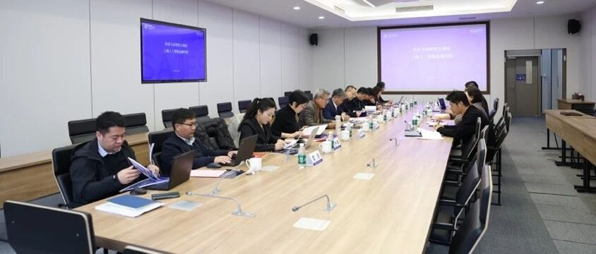
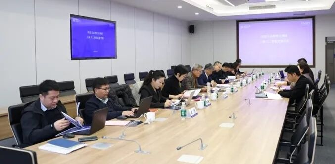
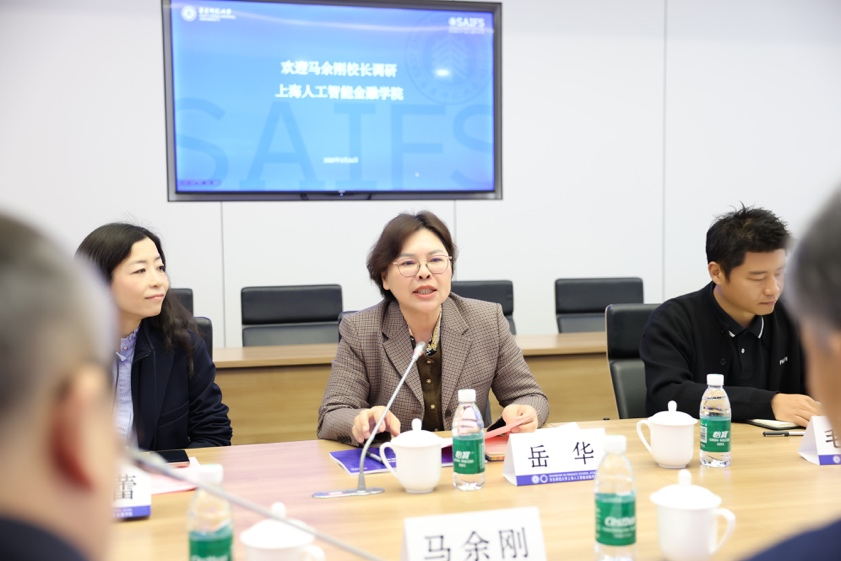
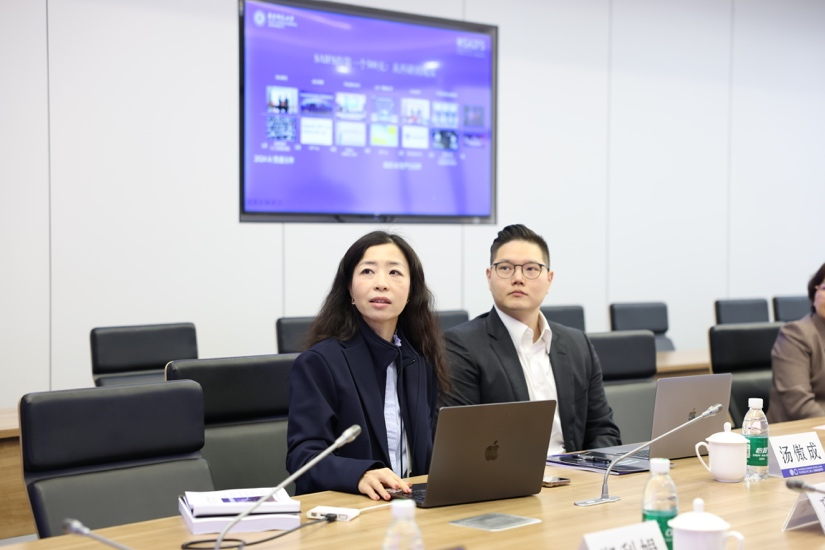
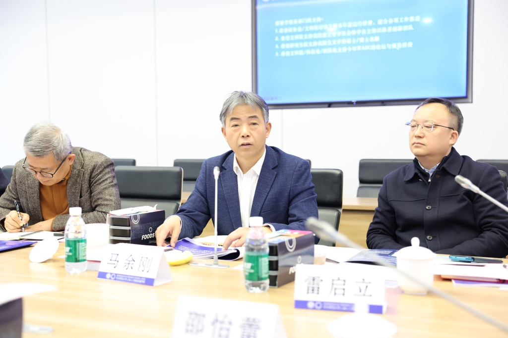

# 华东师范大学校长马余刚院士一行调研上海人工智能金融学院

> **作者**: SAIFS
> **发布日期**: 2026年3月25日 16:33
> **来源**: [原文链接](https://mp.weixin.qq.com/s/sqGbd3ZEwE1bOJn5EeoECA)

---

  

调研座谈会现场

  

  

2026年3月24日上午，华东师范大学校长、中国科学院院士马余刚率队赴上海人工智能金融学院（SAIFS）开展专项调研，副校长雷启立、学术委员会秘书长唐玉光陪同调研。学术委员会、发展规划部、研究生院、财务处、科技处、人文与社会科学研究院、人事处、国际合作与交流处等职能部门负责人参加调研。座谈会在中北校区理科大楼举行，由学院院长助理汤傲成主持。

  

     岳华书记致辞

  

调研座谈会上，学院院长邵怡蕾作“智金院近期工作情况与学院‘十五五’规划报告”，全面汇报了学院自2024年5月成立近两年来的发展历程与核心成果。报告重点展示了学院在构建“硅基经济学”自主知识体系、推进与中国农业银行上海市分行等的产学研合作、发布“全球金融科技中心发展指数（GFTCI）”与“全球AI金融科技中心指数（GAIFC）”、深度参与2025世界人工智能大会（WAIC）等标志性成果。同时，报告对学院“十五五”期间聚焦高级别国际合作、深化“硅基经济学”理论研究、创新人才培养等重点工作进行了规划与展望。经济与管理学院党委书记岳华及学院班子成员参与交流。调研交流环节，与会领导还点评了智金院学生创业团队的“智能体咖啡”项目，亲身体验了学院的创新创业氛围。

  

邵怡蕾院长作报告

  

 马余刚校长总结讲话

  

马余刚校长在听取汇报后，对上海人工智能金融学院在成立不到两年内取得的成绩予以肯定。面向未来，希望学院进一步聚焦人工智能与金融交叉领域的前沿科学问题与国家战略需求，不断强化自身特色，深化有组织科研，整合校内外资源。他鼓励学院师生继续凝心聚力，力争在经济学理论体系构建、高级别国际合作项目、重大产学研项目及拔尖创新人才培养等方面，产出一批有影响力的标志性成果，为服务国家新质生产力发展和上海国际金融中心建设发挥积极作用。  

  

智金院学生创业团队制作的“智能体咖啡”