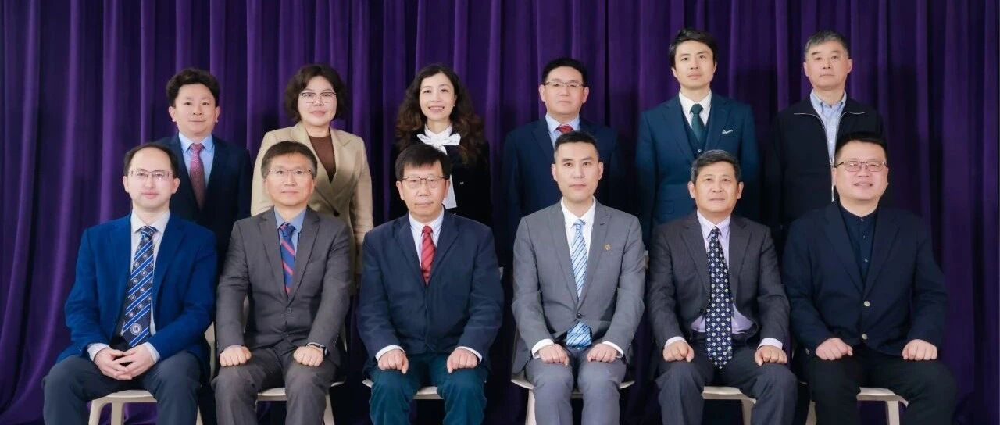
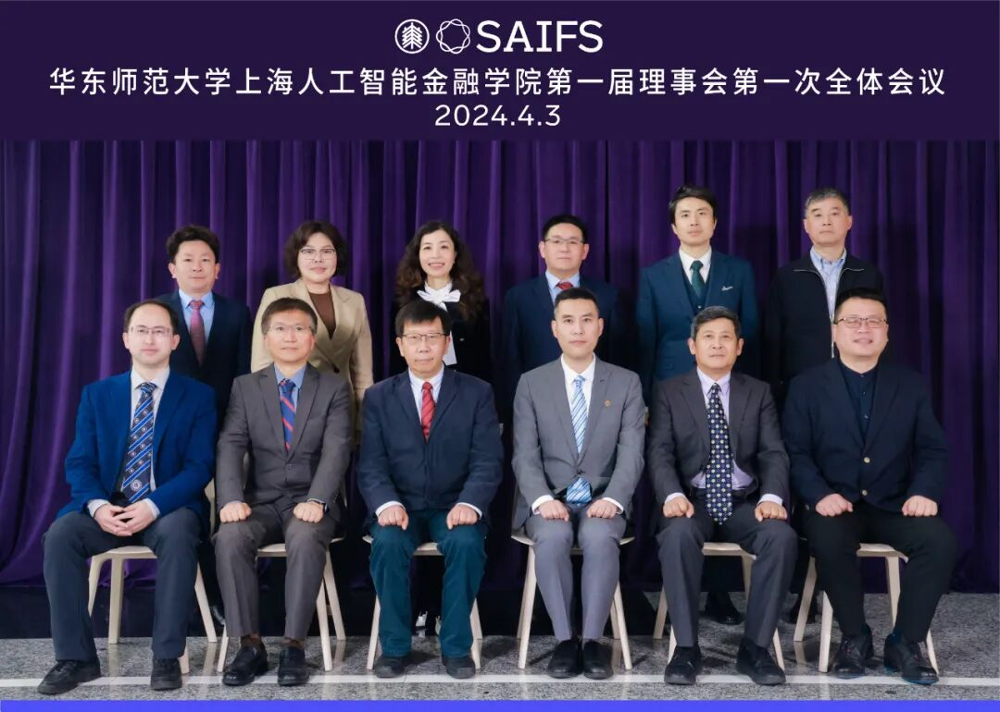
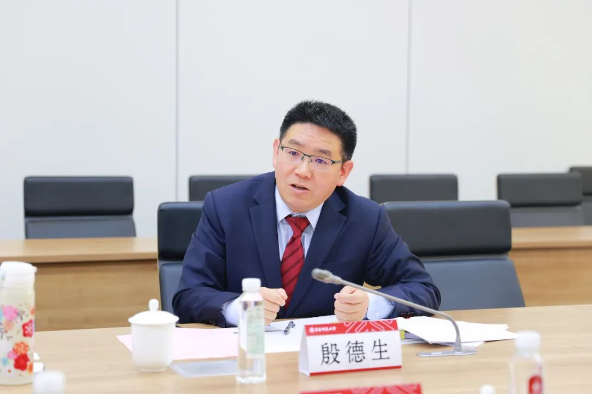
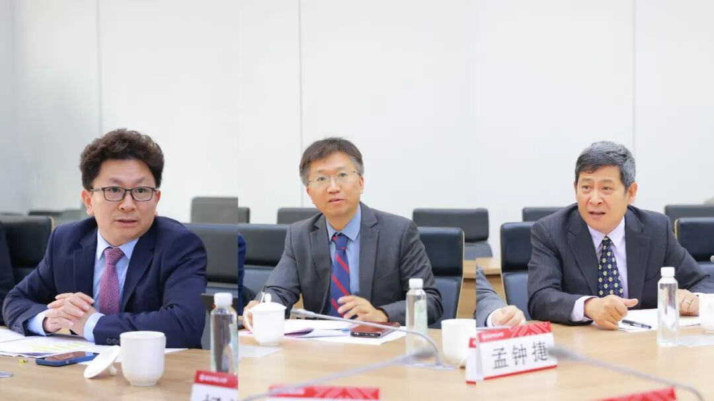
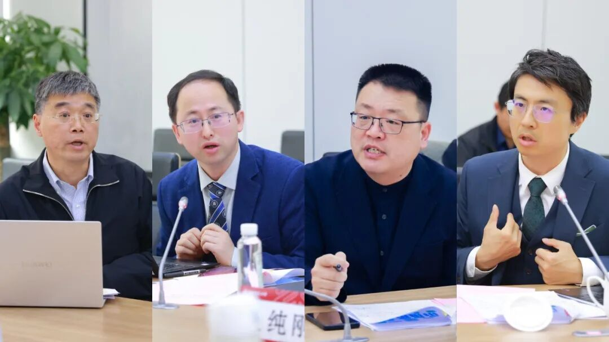
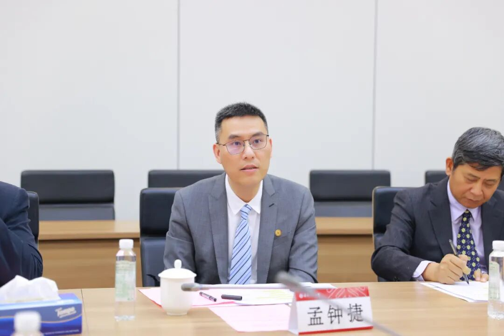
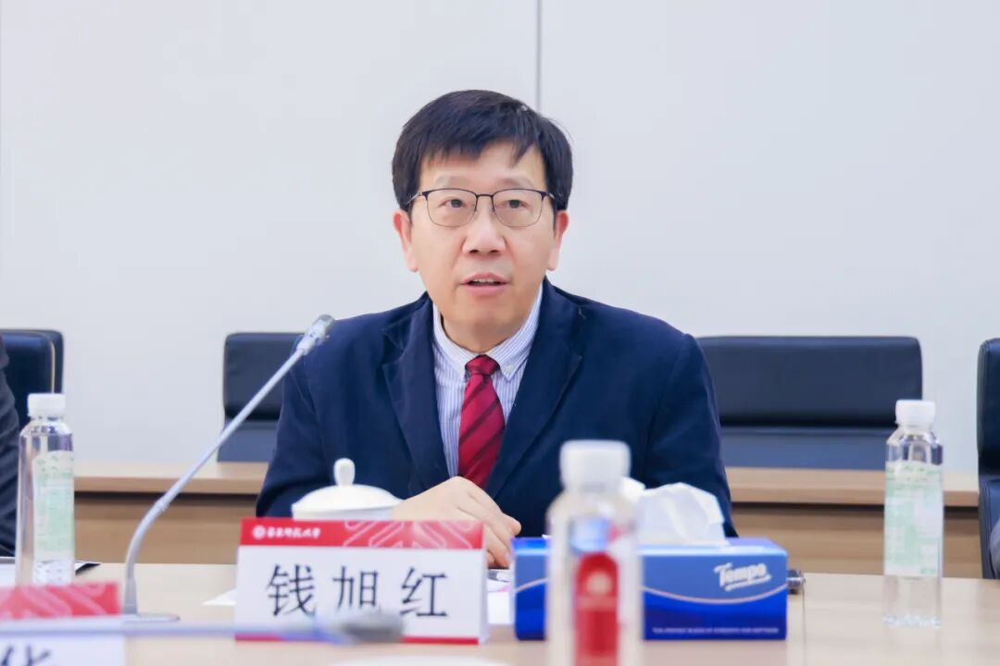

# 以问题为导向，以创新为根本｜华东师大智金院第一届理事会第一次会议顺利举行

> **作者**: SAIFS
> **发布日期**: 2024年4月7日 11:45
> **来源**: [原文链接](https://mp.weixin.qq.com/s/KYEluSISEzkxHpxY2gWazQ)

---

  

华东师大智金院第一届理事会第一次会议合影

  

  

  

4月3日周三上午，华东师范大学上海人工智能金融学院（简称“智金院SAIFS”）第一届理事会第一次会议在普陀校区理科大楼A508会议室召开。华东师范大学校长、智金院理事会理事长钱旭红，党委副书记、智金院理事会副理事长孟钟捷出席会议并讲话，智金院院长、理事会执行理事长邵怡蕾介绍智金院近期工作，会议由经济与管理学院党委书记、智金院理事会理事岳华主持。

  

岳华主持会议

  

经济与管理学院院长殷德生全面汇报了依托经济与管理学院的校管科研平台上海人工智能金融学院的筹建过程和功能定位，强调在人工智能和新一轮科技革命浪潮下发展人工智能金融学科，是增强金融服务实体经济能力、服务上海国际金融中心新一轮建设的重要引擎。殷德生院长就打造人工智能金融交叉学科高地提出了具体规划，开设人工智能金融研究生学位点，强化与政府部门、行业巨头等在人工智能金融领域深化合作，全面实施人工智能+金融、人工智能+管理等学科提升行动，聚焦人工智能金融大语言模型实验室建设和系列垂类大模型产品的发布，为学校“数智跃升”计划贡献力量。经济与管理学院全力整合量化金融、智能金融、人工智能应用、大数据管理与商业分析等方向的师资力量，集合学校信息学科等相关力量，引进全球人工智能金融领域的优秀人才，支撑智金院自主开发大数据驱动的人工智能金融决策系统，打造可信人工智能金融的大模型、测试基准、测试数据库及开放平台。

  

殷德生介绍智金院筹建工作情况

  

智金院院长邵怡蕾重点介绍学院近期工作情况。在智金院组织架构方面，将更好发挥理事会决策咨询作用，赋能智金院建设发展。智金院将设立由海内外专家学者组成的学术委员会，为智金院学术发展提供指导和支持。另外，智金院将设立专项基金，推进学院未来的建设和人工智能金融学科领域的创新发展。邵怡蕾重点介绍智金院学科交叉研究、人才培养项目建设等方面的工作规划和近期工作推进情况。智金院将致力于研究人工智能如何赋能金融在时代变革中的创新发展，通过人工智能金融领域的硕士和博士研究生项目，全面深化人工智能金融领域人才培养。在人工智能金融MBA项目中，培养具备深厚金融知识和先进人工智能技术的新一代领导者。学院将致力于深度融合金融与人工智能、拓展全球化视野、整合提炼跨学科知识以及打造以通识教育为基础的学习体验。

  

邵怡蕾还详细介绍了即将在5月31日至6月1日于华东师大普陀校区举办的2024SAIFS学术年会。本次学术年会的主题为“新生：人工智能与金融世界的对话“，学院将邀请来自4大洲的18位重磅嘉宾，设立3大主题，共计18个主题报告和3场圆桌论坛。本次学术年会的闭幕式暨After Party当晚将现场打造“AIGC之夜”，以打破圈层、打破时空、打破极限的方式，在全球范围内首次呈现“第十艺术：人与AI互动的艺术”，展现人与AI共生的一个开端性时刻。

  

邵怡蕾介绍智金院组织架构及近期工作

  

在理事会成员讨论智金院工作过程中，大家围绕人工智能金融学位点建设拓展、人工智能金融学位项目招生、人才引进、实验室建设以及学术年会等事宜开展了交流，理事会成员为智金院建设发展积极建言献策。

  

研究生院副院长杨福义对智金院推动建立交叉二级学科学位点工作表示支持，同时对人工智能金融MBA项目的交叉性和特色性表示赞同。他认为智金院应依托经济与管理学院现有的师资力量，尤其是具有计算机博士学历背景的教授力量，共同推动交叉方向的人工智能金融二级学科学位点建设。在人工智能金融MBA项目特色方面，针对人工智能技术在金融中的合规管理提出了进一步工作建议，智金院可以与学校合规研究中心共同在课程建设、研究方向、实验室合作上开展协作。金融大语言模型实验室团队的科研产出等工作也将为智金院学位点建设提供支撑。

  

在未来发展规划方面，华东师范大学发展规划部部长段纯刚充分肯定智金院的规划方向和工作思路，他认为人工智能在金融领域的应用十分重要，尤其是在拔尖人才队伍建设方面，要更加注重如何进一步发挥人才队伍强有力技术支撑，为智金院整合创新思维推动学科发展贡献力量。他指出智金院未来可将“精通兼容”作为发展规划的工作重心，打通人工智能和金融的就业场景，提高人工智能金融领域的就业价值。

  

在人才引进工作方面，华东师范大学人事处处长濮晓龙提出相关建议，包括要针对学院未来骨干人才、教学人才、科研人才、教学\-科研并行人才的岗位目标、招聘要求、考核模式、培养方向进行深入规划，人事处也将在智金院双聘教授等工作上给予大力支持。

  

自左向右：杨福义、段纯刚、濮晓龙讲话

  

在外专来访方面，华东师范大学国际交流处副处长周勇指出智金院未来可申请高端外专项目，对于海外知名教授领衔带领的工作团队，可以进一步利用人工智能的优势申请建设相关工作基地。华东师范大学科技处处长杨海波认为，智金院未来可考虑建设新型研发机构，并在该机构中充分运用更加灵活的选人用人机制。此外，华东师范大学人文与社会科学研究院院长吕志峰对建设“人工智能+人文”省部级实验室也提出了宝贵意见。华东师范大学政治与国际关系学院院长吴冠军在学校内部学院相互合作和资源互动上也表示将给与充分的工作支持。

  

自左向右：周勇、杨海波、吕志峰、吴冠军讲话

  

在会议总结环节，华东师范大学党委副书记、智金院理事会副理事长孟钟捷首先肯定了智金院邵怡蕾院长作为人工智能金融领域运营型人才，为管理工作带来了新面貌。他认为智金院的成立离不开学校各个职能部门的配合和支持，尤其是在解决学院的建设运行问题上，如何与现有的制度相互协同，也是一个需要持续探讨的问题。智金院理事会成立的主要目的是以问题为导向、以创新为根本，如何在现实框架内解决实际问题，以及如何用具体的办法来进行改革创新，这都需要通过特定的平台机制去实现。他充分肯定邵怡蕾院长及经管学院在智金院前期筹备等各项工作上的努力，同时表示学校各职能部门会继续支持智金院在各个方向上的工作开展。

  

孟钟捷讲话

  
最后，华东师范大学校长、智金院理事会理事长钱旭红作总结讲话，他高度评价智金院建设规划，并对经济与管理学院给与智金院建设的支持予以肯定。他强调，在快速变革的人工智能时代，针对人工智能金融领域，人才评价体系亟需更新。学校应成立AI行动组推动工作开展，在人才培养方面，智金院应采纳“1+X”工作模式，其中“1”代表骨干人员，“X”表示各类加盟的研究人员和博士后等力量，智金院应致力于培养和组织这些关键人才，以此推动学院在科研和教学领域的全面进步。在当前金融行业发展大背景下，我们要进一步认识人才储备和社会服务的重要性，要确保学院骨干人员队伍建设，要进一步依托经济与管理学院金融学等相关领域的工作优势，推动智金院在校外建立研究机构，服务政产学研工作开展。他最后强调，智金院作为小而精的开放科研平台，要将未来发展视为一项重要工作，通过深思熟虑的规划和解决策略为学院开辟新的应用研究方向。

  

钱旭红作总结讲话

  

据悉，学校于2023年批准成立的华东师范大学上海人工智能金融学院，作为科研型新型学院，将通过系统整合相关力量，赋能经济管理等学科实现跨越式发展。此次学校上海人工智能金融学院第一届理事会第一次会议的顺利召开也是进一步深化举措推动智金院建设的一项重要工作。

  
图文提供｜华师大智金院SAIFS、华师大经管学院

  

**附：华东师范大学上海人工智能金融学院**  

**第一届理事会名单**  

  

理事长：钱旭红

副理事长：孟钟捷

执行理事长：邵怡蕾

理事（按姓氏笔画排序）：

吕志峰  杜震宇  杨海波  吴冠军

吴   健  张桂戌  邵怡蕾  岳   华

孟钟捷  段纯刚  钱旭红  殷德生

唐玉光  濮晓龙