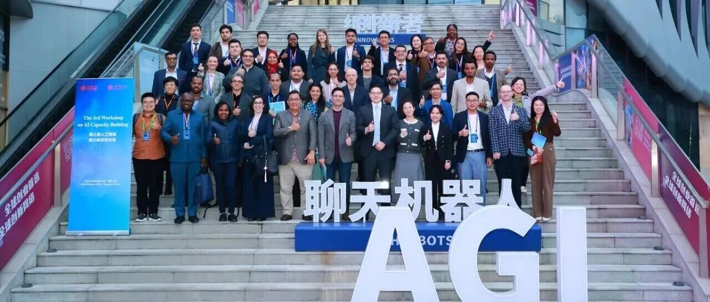
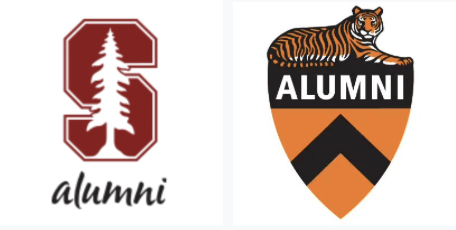
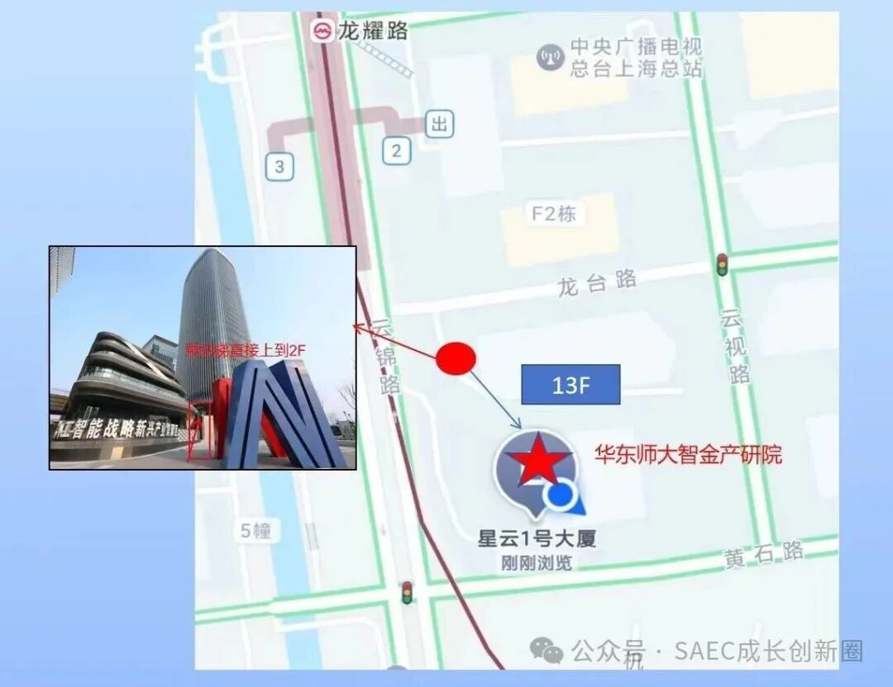
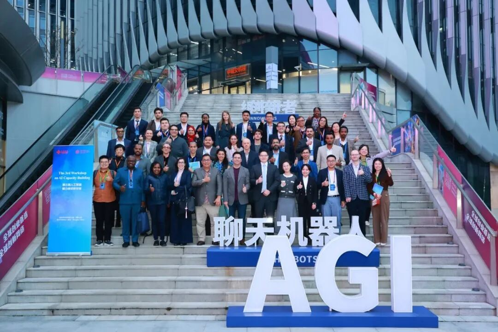
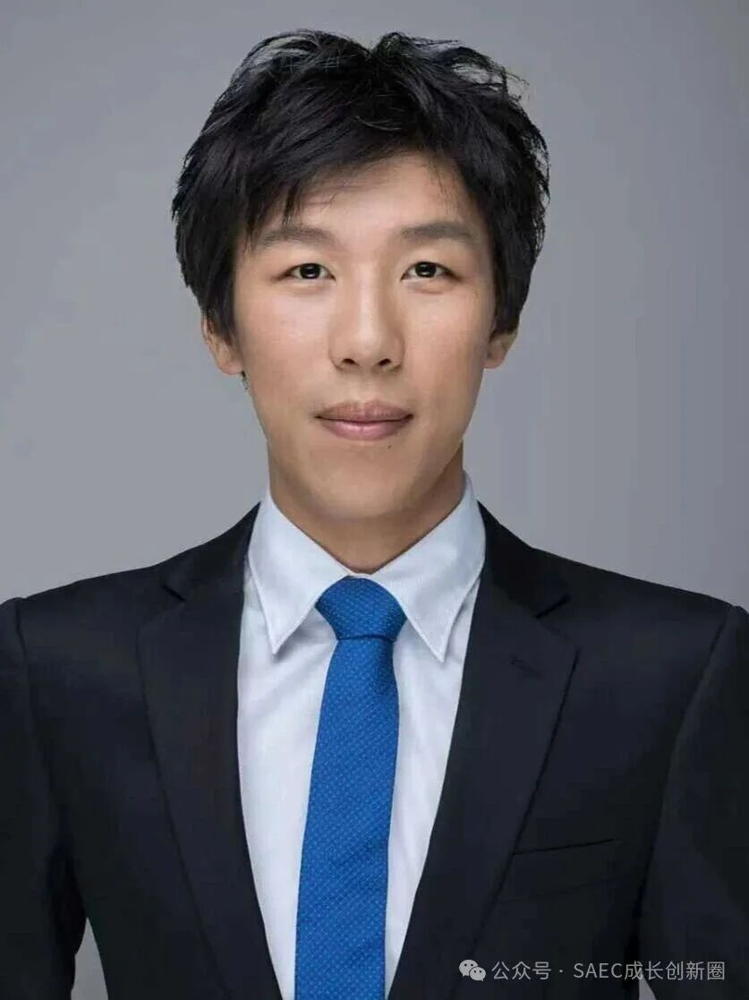
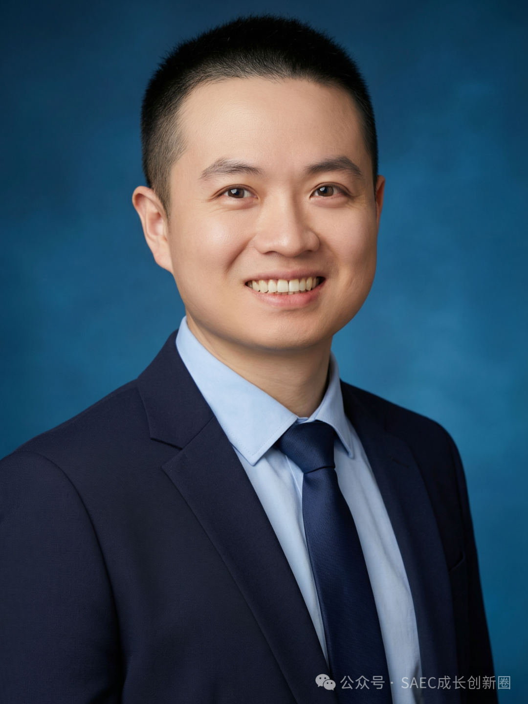
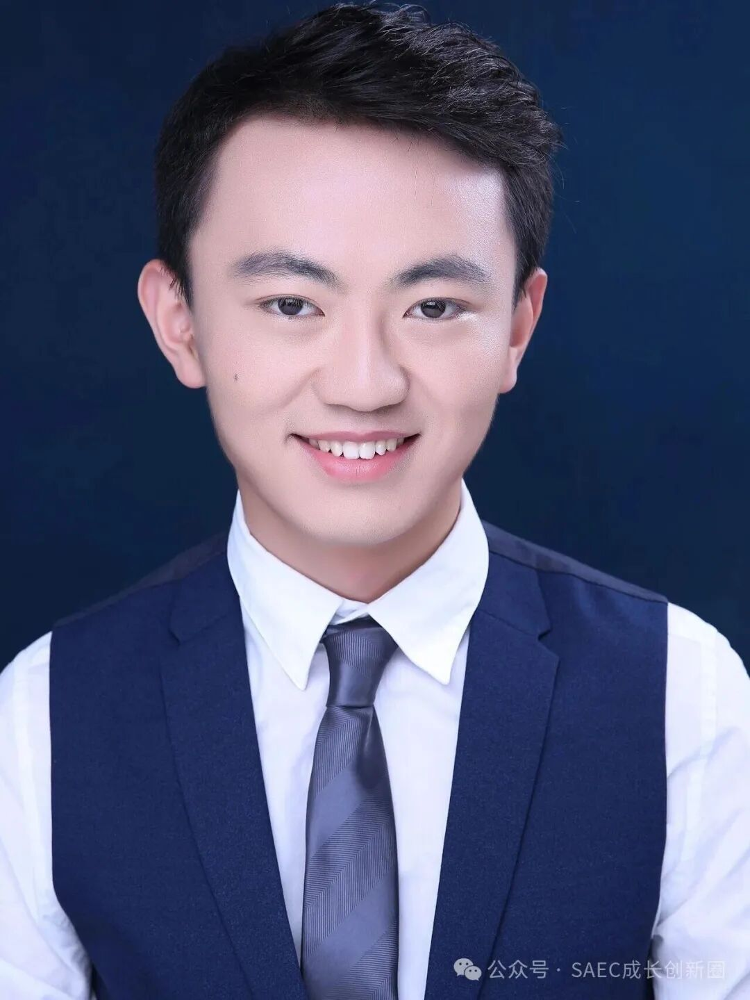
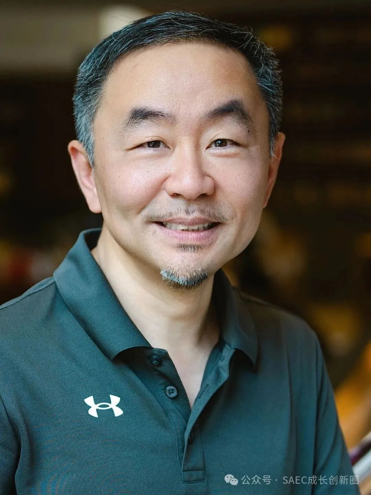

# 活动预告 | 斯坦福上海创业讲座：智能体和小龙虾的应用场景和实战心得

> **作者**: 斯坦福成长创新圈
> **发布日期**: 2026年4月15日 12:31
> **来源**: [原文链接](https://mp.weixin.qq.com/s/R_n4eZDJjj8UjsfJMmzUyg)

---

**‍**

  

****活动预告****

      从2025年Manus惊艳亮相，到今年年初OpenClaw掀起全民“养虾”热潮，AI正历经从“对话”到“执行”的范式转变。智能体技术正被快速应用到各行各业，其中将产生数以万亿计的商业机会，成为了众多创业者积极探索的方向。在这一演进趋势下，[斯坦福成长创新圈](https://mp.weixin.qq.com/s?__biz=MzU2NTU5MTE4Mg==&mid=2247484430&idx=1&sn=6b22b1a164a12677ae310a1b446f771e&scene=21#wechat_redirect)联合普林斯顿大学上海校友会和华东师大上海人工智能金融学院邀您参与此次创业讲座，与资深创业者和投资人一起讨论和分享下列话题：

-   AI智能体的发展历程、现状和前景
    
-   全球发展格局及中美对比
    
-   应用场景、挑战和实战心得
    
-   对经济和社会等方面的影响
    
-   一人公司和AI时代的创业心得
    

    本次活动为线下活动，对外开放，不限于斯坦福和普林斯顿校友。思行AI社群是本次活动的协办方。场地名额有限，先到先得，记得提前报名锁定！（详情见文末“报名与收费”）

  

****讲座信息****

语言：中文

时间：2026年4月25日（星期六）16:00 – 18:00

15:30：签到、自由交流

16:00：讲座开始

地点：上海市徐汇区云视路1号13层（华东师大智金产研院）

  

  

  

****嘉宾介绍****

  

    邵怡蕾教授是华东师范大学上海人工智能金融学院创院院长，联合国大学-华东师范大学人工智能金融联合研究中心主任，普林斯顿大学计算机科学博士。她曾于2021年至2023年担任国际人工智能联合会（IJCAI）中国办公室秘书长，并曾在高盛集团纽约总部任职。作为一位学科跨界的开拓者，她不仅关注人工智能技术在金融领域的应用，更积极探索其在艺术和教育领域的创新融合，并深入思考人工智能技术的伦理与治理等前沿问题。

  

  

     范维肖先生是Vivgrid-AI Infrastructure的lnfra CEO，拥有超过20年互联网技术经验，现任Linux Foundation Edge AI基金会理事，长期专注于地理分布式AI推理基础设施（Geo-distributed AI Inference Infra）领域；作为开源技术的积极推动者，他是 Strongly-typed MCP开发框架YoMo的核心维护者。范维肖先生是连续创业者，曾创办的三家公司均实现并购退出；同时他也活跃于前沿科技领域的早期投资，是商汤科技、奇安信等知名企业的早期投资人。

  

  

    韦东东先生是上海玄武纪人工智能科技有限公司CTO，企业大模型应用创业者，前平安集团某科技子公司产品负责人，《RAG落地之道：从工作流到企业级Agent》作者。玄武纪人工智能是国内头部智能印章管理科技企业，服务4000余家大型国央企及上市公司客户，覆盖建筑、能源、金融、制造等行业；在智能印控硬件及办公协同机器人产品矩阵基础上，公司深耕企业级大模型应用，在制造、金融等行业积累了丰富的成熟落地案例。

  

  

    **徐瑞阳**先生是NYX Ventures CEO，曾参与字节跳动、蔚来汽车、Mistral AI、Hugging Face和Genspark 等等中美科技企业的投资。**NYX Ventures**专注投资AI早期应用，已投项目包括Mistral AI, Gyges Labs，FastMoss和ChanceAI等快速成长的AI初创企业。

  

********主办人************‍‍‍‍‍****

  

    李俊杰博士是丽瓦信息的董事总经理，获美国斯坦福大学经济学博士和法律博士学位，拥有中国和美国纽约州两地律师资格。李博士曾长期在美国纽约、香港和上海从事法律工作，先后在美国律所Morrison & Foerster LLP以及中国律所金杜和中伦担任合伙人。李博士曾在美国硅谷创立互联网软件公司NAISA Systems并任CEO。丽瓦信息创立于2014年，聚焦数字经济、人工智能、绿色能源和中国企业出海等领域，为全球科技创业公司和成长期企业提供战略、业务落地和合规、AI应用实施等多方面的咨询，并推动和孵化AI赋能下软件和机器人领域的创新创业，建设协作生态。李俊杰博士是斯坦福成长创新圈理事长、斯坦福大学上海校友会副会长。

  

****报名和收费****

    如有意参加，欢迎提前占位，本次活动收取100元费用。请长按识别二维码，通过“友付”完成报名和支付，报名后恕不退款。如想加入本次活动的微信讨论群，可添加微信号“StarryCX330”，备注“0425”，等待验证通过即可。

     期待您的加入！

  

