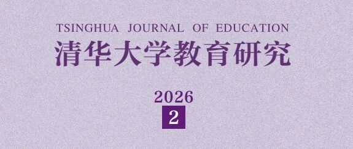

# 学术发表丨邵怡蕾：智能盈余的再生产：当五位诺奖得主的假设同时失效

> **作者**: 
> **发布日期**: 2026年4月27日 09:46
> **来源**: [原文链接](https://mp.weixin.qq.com/s/mg4pdySTJ-D8a2MVJfWU2Q?poc_token=HEvA8mmjz9oEuc4Mi4BpACXeXYQV0FgYtmW3PCRY)

---

点击上方蓝字关注我们文章来源:《清华大学教育研究》2026年02期作者简介:邵怡蕾，华东师范大学上海人工智能金融学院院长、教授，研究方向为硅基经济学、人工智能金融、AI与教育经济学.DOI:10.14138/j.1001-4519.2026.02.002411【摘 要】当大语言模...