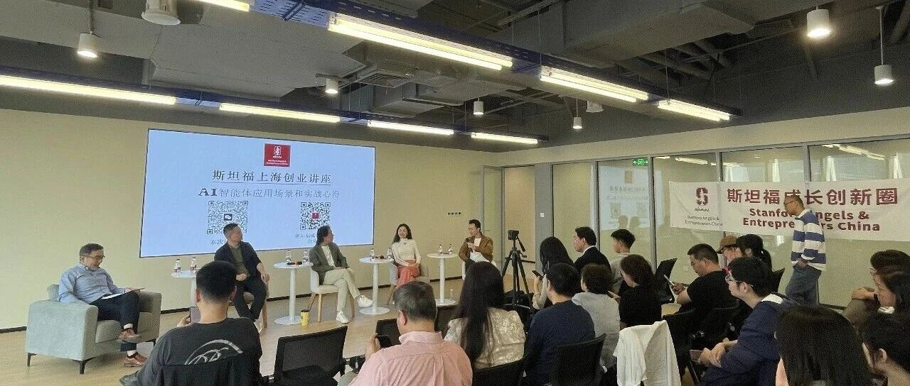
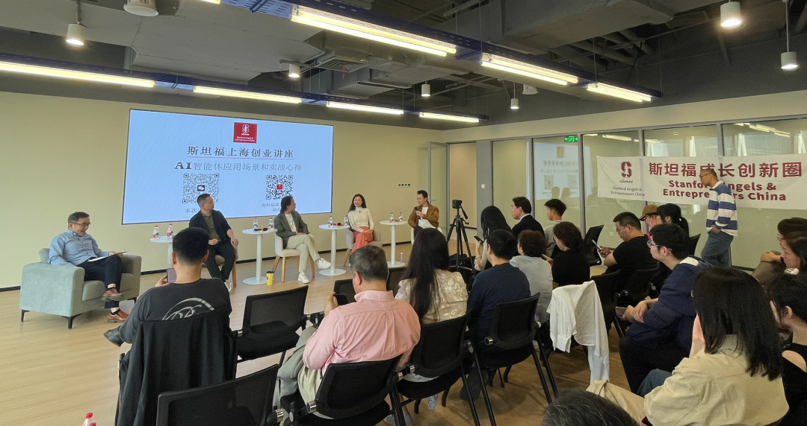
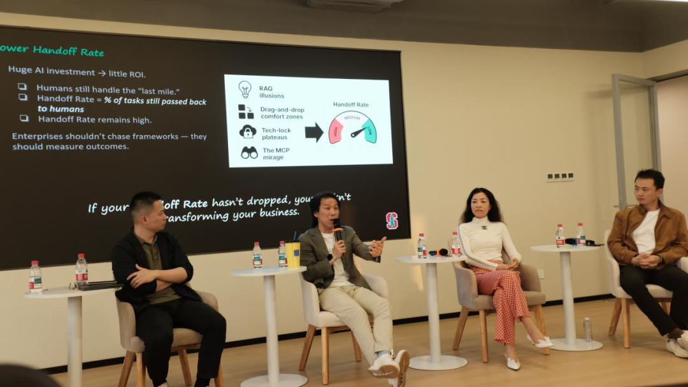
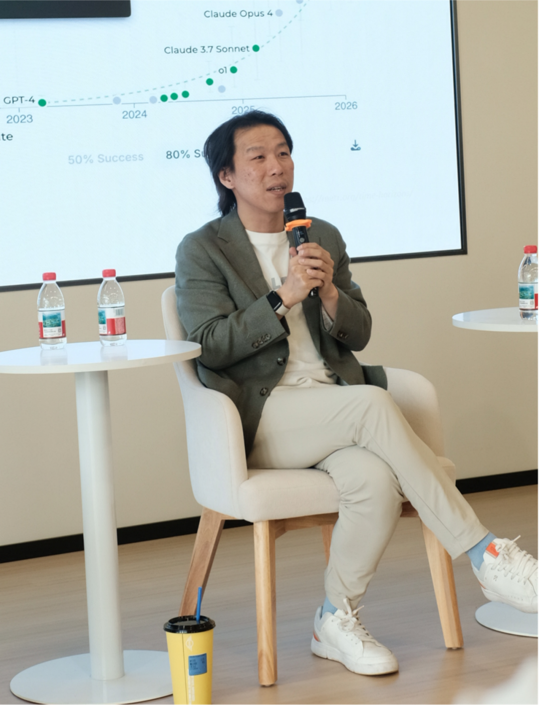
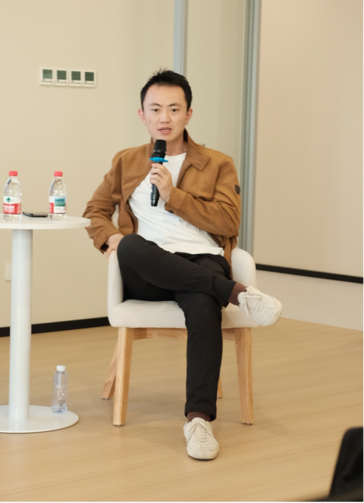
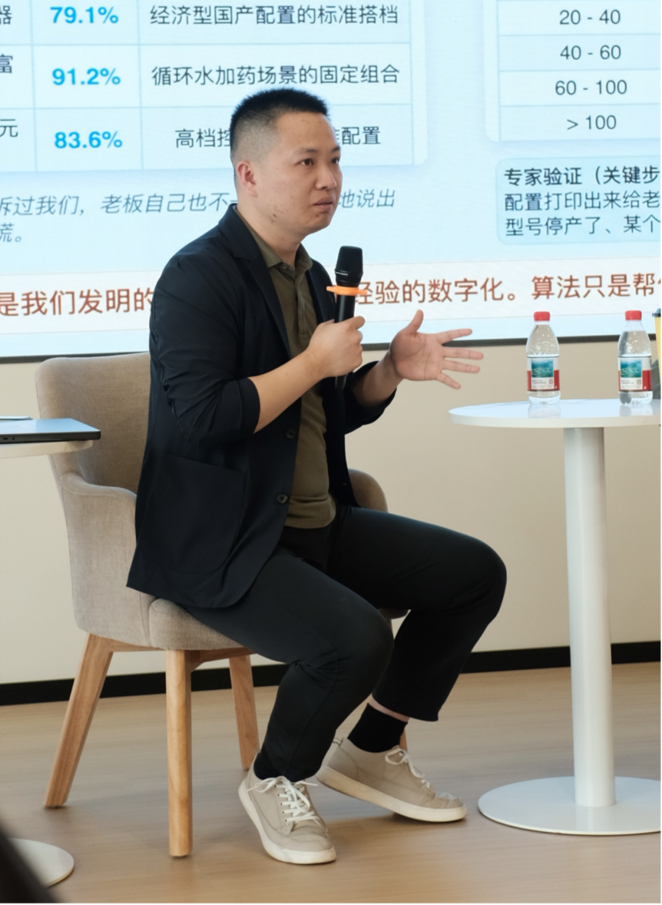
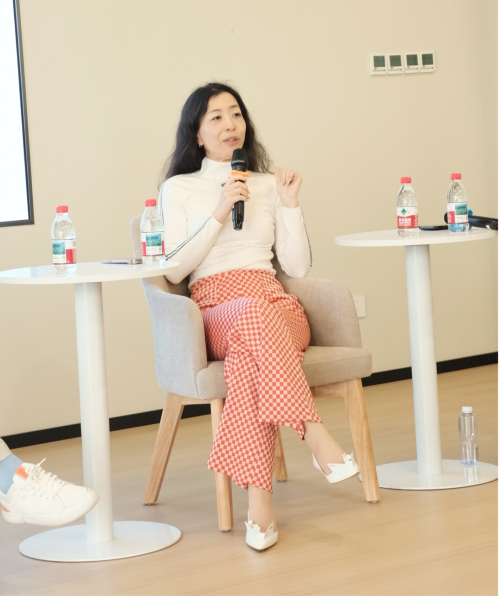
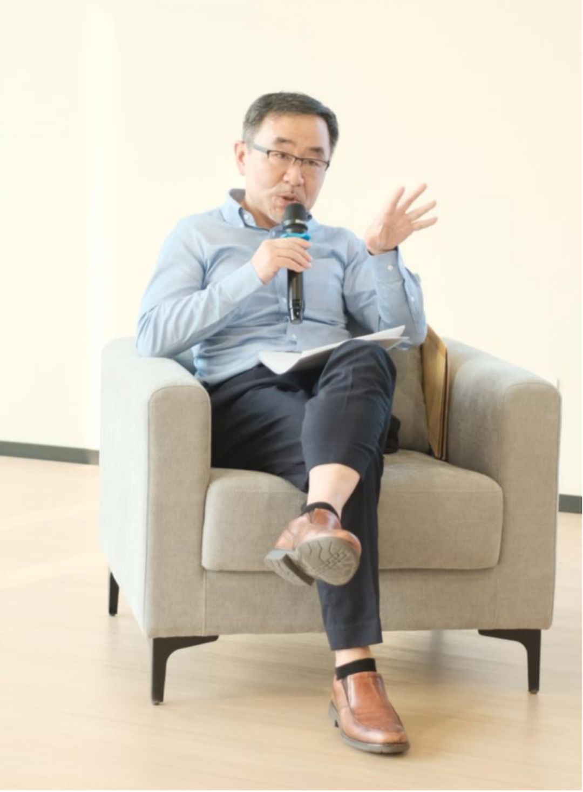
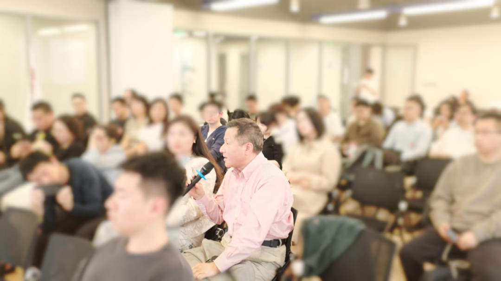
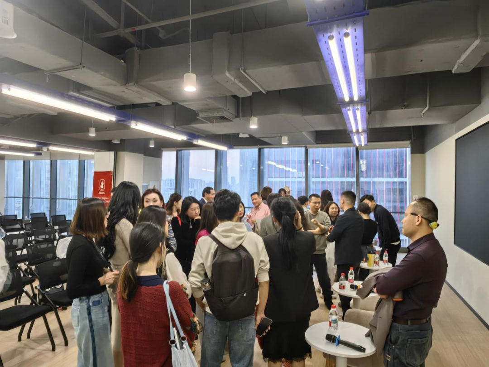

# 讲座回顾 | 斯坦福创新圈/智金院联合活动：智能体和小龙虾的应用场景和实战心得

> **作者**: 斯坦福成长创新圈
> **发布日期**: 2026年4月28日 10:16
> **来源**: [原文链接](https://mp.weixin.qq.com/s/YbExmfos6iEpvWsYQdfHLQ)

---

  

  

  

       2026年4月25日下午4点，**斯坦福成长创新圈**联合**普林斯顿大学上海校友会**和**华东师大上海人工智能金融学院**举办了新一期的**斯坦福创业讲座，**主题是智能体的应用场景和实战心得，吸引了众多校友、创业者和投资人报名参与，**思行AI社群**是本次活动的协办方。

  

       

     本次讲座中，李俊杰作为主持人与范维肖CC、邵怡蕾、韦东东和徐瑞阳四位嘉宾围绕AI智能体的发展现状、前景与全球格局，AI智能体应用落地的场景和心得，以及AI时代的创业和投资机会等话题进行了精彩讨论与分享，并回答了现场观众提问。

  

从左到右依次为韦东东、范维肖CC、邵怡蕾、徐瑞阳

  

      李俊杰是斯坦福大学经济学博士和法学博士，现为丽瓦信息董事总经理，斯坦福成长创新圈理事长、斯坦福上海校友会的副会长。**范维肖CC**先生是Vivgrid-AI Infrastructure lnfra CEO、Linux Foundation Edge AI基金会理事，连续创业者，长期专注于地理分布式AI推理基础设施（Geo-distributed AI Inference Infra）领域。**邵怡蕾**教授是华东师范大学上海人工智能金融学院创院院长，联合国大学\-华东师范大学人工智能金融联合研究中心主任，普林斯顿大学计算机科学博士。**韦东东**先生是上海玄武纪人工智能科技有限公司CTO，企业大模型应用创业者，《RAG落地之道：从工作流到企业级Agent》作者。**徐瑞阳**先生是NYX Ventures CEO，曾参与字节跳动、蔚来汽车、Mistral AI、Hugging Face和Genspark 等等中美科技企业的投资。

      嘉宾的详细个人介绍请参见本次讲座的活动通知，以下是本次讲座的内容摘要。

      1.AI智能体的发展历程、现状和前景

      范维肖CC引用了黄仁勋的观点，指出OpenClaw成功的核心在于将大模型和工具结合。AI和现实世界开始结合，与大模型的响应速度和使用成本相比，长时间处理任务的能力更需要被关注。数据表明，大模型每7个月处理长时间任务的能力提升一倍。未来硬件将成为制约能力的瓶颈，长时间处理任务所需的推理数据交换需要硬件架构的提升。

  

范维肖CC

  

      徐瑞阳从投资和使用体验出发，回顾了从AutoGPT 到Manus和Genspark， 再到OpenClaw的演进。他认为行业真正的分化点在于交付能力、成本结构和易用性，而不只是模型本身是否先进。未来更有价值的智能体，将能够帮助用户完成一整段工作流，而不是只提供局部能力。

  

徐瑞阳

  

     2.应用场景、挑战和实战心得

     韦东东分享了其利用智能体为一家非标设备厂商做的报价系统，通过对7000多份报价单进行结构化处理、聚类分析和业务规则提炼，收敛出20份标准模式与规则配置。经客户审核，90%内容正确，将客户十几年行业经验通过算法进行数字化，显著缩短了检索与决策时间，提高了效率。

  

韦东东

  

     **范维肖CC**表示，OpenClaw的企业级应用可以从两个角度应对安全问题，一是在OpenClaw接大模型时通过系统提示词进行拦截，二是通过配置小龙虾的外骨骼，将企业级的工具部署到agent之上，支持copilot模式或者以虚拟员工身份在安全的权限内运行。

  

     **邵怡蕾**教授从更宏观的角度提出，很多人当前对AI 的使用方式仍然偏保守，未能真正释放其潜力。AI的目标不应只是局部提效，而应争取数倍乃至数量级的效率提升。

  

     **邵怡蕾**

     **李俊杰**博士也分享了其最近构建的一个文案生成系统，由三个智能体协同、多轮迭代；其中一个智能体负责写作，一个负责挑刺提出批评，还有一个负责审核。系统还设计了机制缓解生成式AI每次生成重新“开盲盒”的问题，以提升迭代效率。他鼓励大家不仅限于与AI对话，积极尝试应用AI的其他方式。

  

    李俊杰

  

     3.一人公司和AI时代的创业心得

     韦东东分享了为某工控软件龙头企业做售后知识库的案例，项目涉及大量文档清洗、知识整合和客服答疑场景，帮助工程师提升响应效率，降低了重复答疑成本。企业对AI的核心诉求往往非常具体，重点不在于概念包装，而在于能否快速交付、直接见效并形成可持续价值。

  

      范维肖CC表示看好两个创业方向，一种是业务在 Day1 就能产生现金流的 Agent，二是重点关注那些在模型不断进化后仍然成立的需求，例如工具调用、多智能体协作、基础设施治理和跨系统服务能力。

  

      邵怡蕾院长提出，AI时代的一人公司本质上是一个人带着一群AI 工作。未来可能出现的新机会，不只是在传统企业流程中做局部优化，而是在面向“硅基主体”的新型服务体系中寻找增量空间，包括能源、数据中心以及面向Agent的各类基础服务。

  

      徐瑞阳指出，目前人均利润最高的上市公司是一家做飞机租赁的公司，渤海租赁AerCap，人均利润500多万美金。将来成功的一人公司年人均利润可达上亿美金。

  

     4.全球发展格局及中美对比

     邵怡蕾教授认为，美国更倾向于追求高精尖模型与前沿创新能力，中国则更擅长在工程化、供应链和性价比层面形成优势，并通过丰富的应用场景推动落地。中美差异很大，不过目前只有中美两国能生产输出token，全世界都会向两极靠拢。

  

     范维肖CC分享其在不同市场的不同战略侧重，在欧美市场优先降低人力成本，但在中国市场则优先覆盖场景。

  

     在讲座最后，嘉宾们还回答了现场观众提出的“面对像伊朗互联网断网无法调用大模型时该怎么办？”等问题。

  

     观众提问环节

  

     两个多小时的讲座分享很快结束，与会者们意犹未尽，在活动结束后继续与主持人与嘉宾们进行热烈讨论。斯坦福成长创新圈定期举办活动，下一期活动将会在不久后举办，敬请期待！

  

会后交流