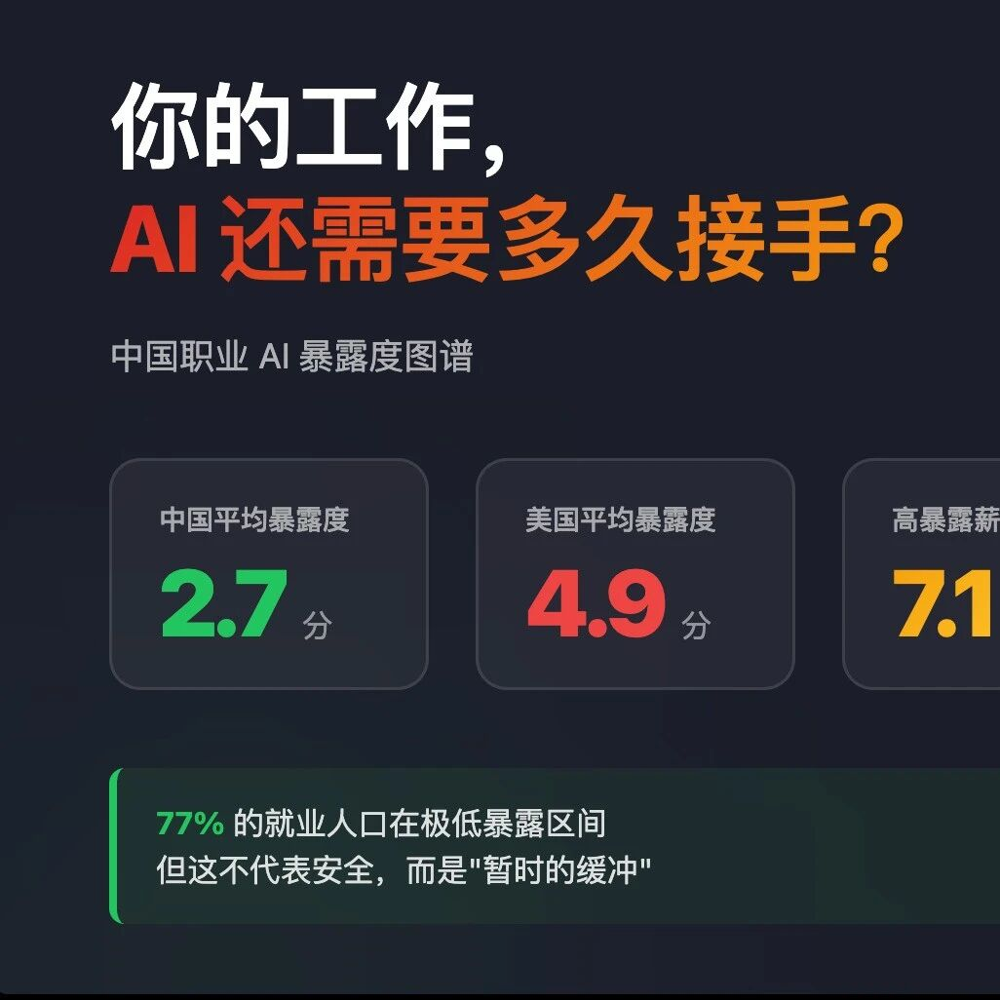

# 文理交叉跨学科培育项目 | 汤傲成助理教授：《AI职业暴露与劳动力市场重构——多维异质性分析与多智能体动态仿真》

> **作者**: SAIFS
> **发布日期**: 2026年5月8日 09:40
> **来源**: [原文链接](https://mp.weixin.qq.com/s/6RF6ijWoVpNCldDwL1HGxg)

---

  

  

     以大语言模型为核心的生成式人工智能技术自2022年底以来快速扩散，深刻改变了全球劳动力市场的任务分工结构。在此背景下，智金院助理教授汤傲成撰写的《AI职业暴露与劳动力市场重构——多维异质性分析与多智能体动态仿真》入选华东师范大学文理交叉跨学科培育项目。本项目旨在构建系统刻画人工智能对就业结构影响的多维分析框架，重点揭示高暴露与低暴露岗位群体之间的结构性分化机制及其对就业结构转型的深层含义，为相关政策制定提供基于扎实实证的科学依据。

  

