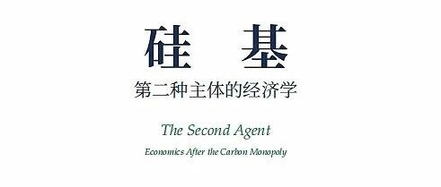
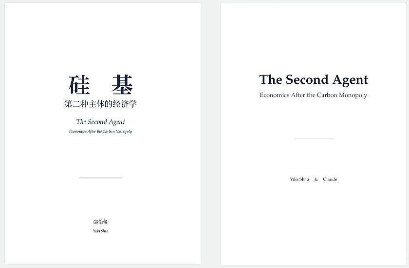

# 精品力作培育项目 | 邵怡蕾教授：《硅基经济学——面向AGI时代的中国自主经济学理论体系建构》

> **作者**: SAIFS
> **发布日期**: 2026年5月8日 09:40
> **来源**: [原文链接](https://mp.weixin.qq.com/s/eSr7uSAi4vgrNH3xG4sYmg)

---

  

  

  

     当下，建立在西方新古典经济学碳基假设之上的既有理论框架已难以有效解释AGI带来的深层冲击，中国在AGI经济学领域也面临自主理论体系的缺位。在此背景下，智金院邵怡蕾教授主持撰写的《硅基经济学——面向AGI时代的中国自主经济学理论体系建构》入选华东师范大学中国自主知识体系精品力作培育项目。项目将以此为契机，致力于建立硅基经济学基础理论框架，为中国AGI时代的政策制定提供理论依据，并为构建AGI时代中国自主经济学知识体系奠定学科基础。

  

