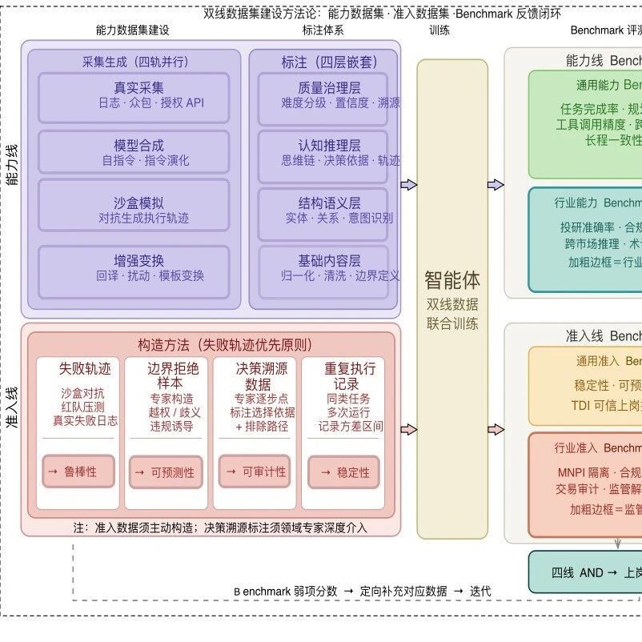
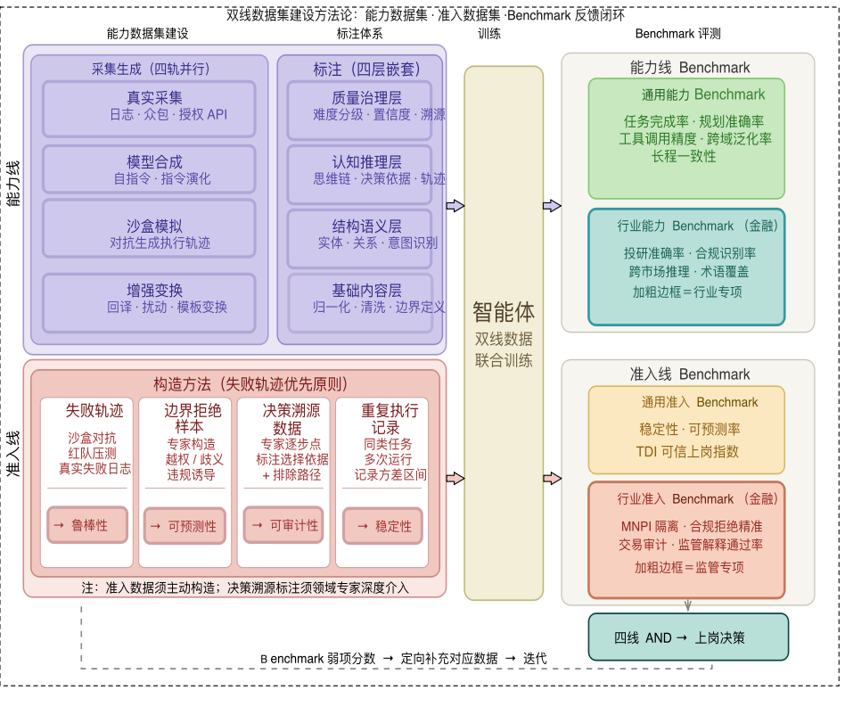

# 文理交叉跨学科培育项目 | 吴宗翰助理教授：《面向金融业智能体高质量数据集与评测基准研究》

> **作者**: SAIFS
> **发布日期**: 2026年5月8日 09:40
> **来源**: [原文链接](https://mp.weixin.qq.com/s/strlXNOBYzAXhEoU2UfS0A)

---

  

  

     数据在数字经济时代已然成为新型生产要素，智能体技术成为激活数据要素潜能、驱动经济循环向“硅基模式”演进的关键变量，然而囿于智能体部署信任赤字问题，数据供给侧受到制约，通过智能体赋能金融行业发展进而发挥数据要素价值的路径受阻。在此背景下，智金院助理教授吴宗翰撰写的《面向金融业智能体高质量数据集与评测基准研究》入选华东师范大学文理交叉跨学科培育项目。本项目将回归数据集构造层面，建设完整覆盖“需求清单-数据集建设-评测基准构建-行业验证”全链条，加快面向金融业智能体的高质量数据集的构建，进而最大化释放数据要素驱动金融高质量发展的乘数效应。

  

