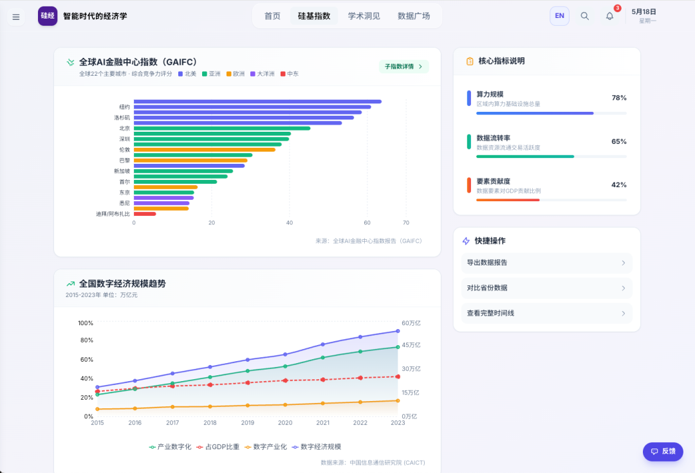
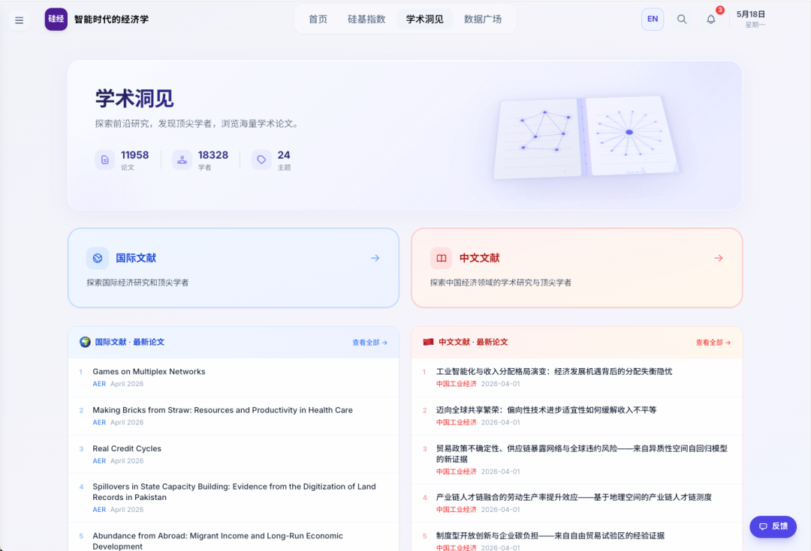
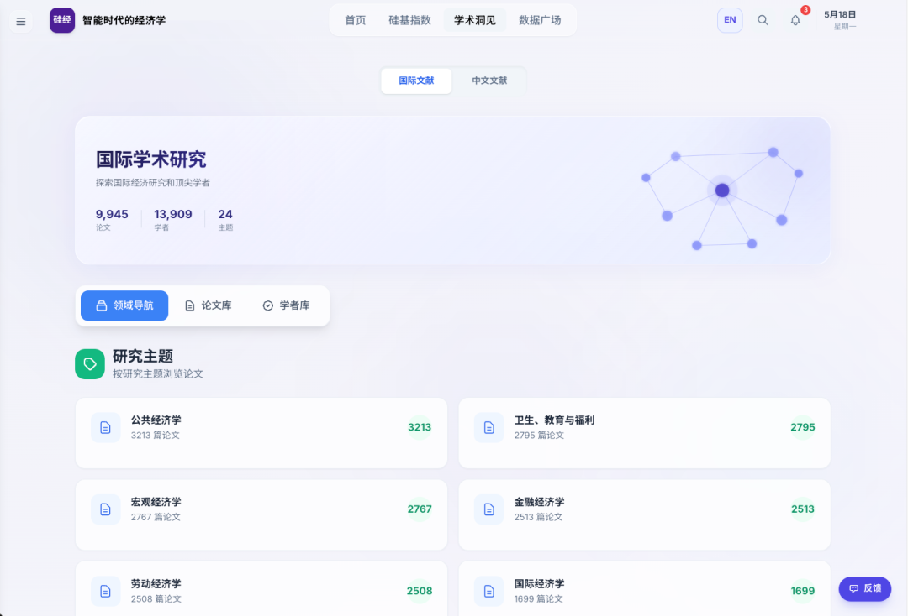
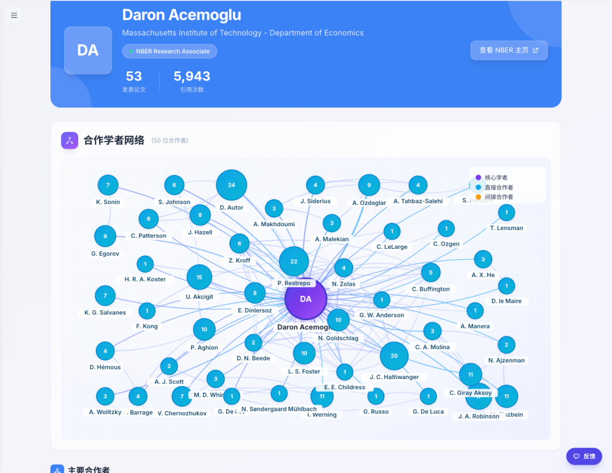
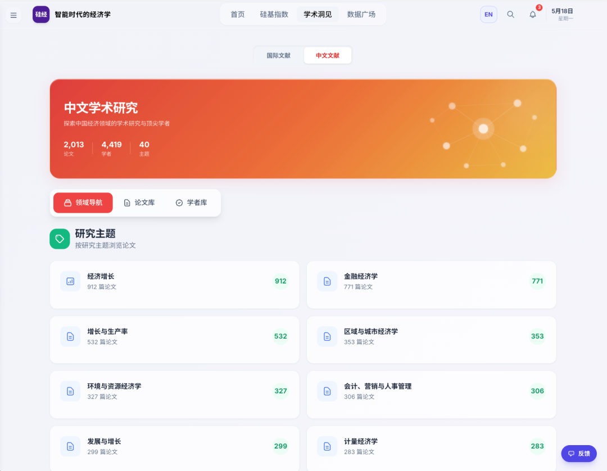
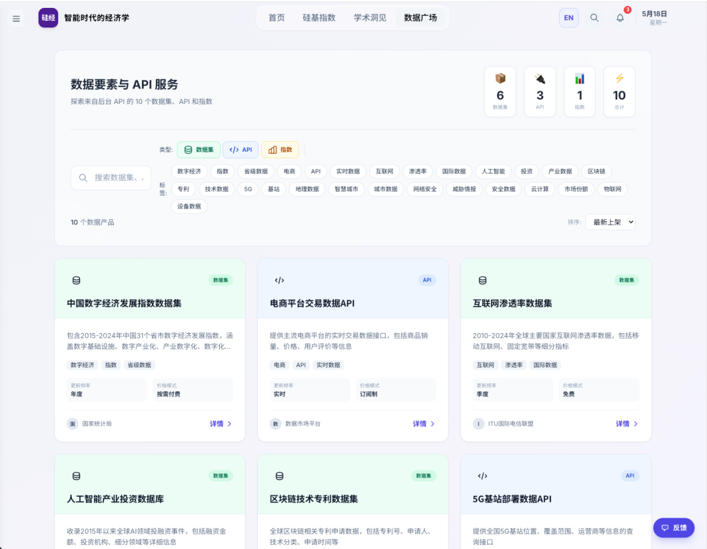

# 聚焦硅基经济学研究，智金院“硅基经济学人”科研基础设施平台正式上线

> **作者**: SAIFS
> **发布日期**: 2026年5月18日 16:46
> **来源**: [原文链接](https://mp.weixin.qq.com/s/gtrSxMyEkRjG3nxUVMoAUQ)

---

  

在加快构建中国自主知识体系的时代背景下，经济学作为一门面向真实世界的社会科学，亟需回应智能技术所带来的变革，发展出立足中国实践、具有原创性的理论范式。2025年3月，华东师范大学上海人工智能金融学院（智金院）院长邵怡蕾教授首次提出“硅基经济学”这一经济学新范式。硅基经济学不再以传统经济学中的“劳动—资本”等碳基逻辑为起点，而是以“算法、算力、数据”三大硅基要素为核心，将人工智能、大模型、算力、数据和芯片视为主要生产资料与核心驱动力，重新理解智能时代的经济运行机制与社会生产关系。  

作为一个新兴领域，硅基经济学的相关文献、智库成果、产业报告等学术资源仍较为分散，研究者获取文献和数据的成本较高。为此，智金院团队经过数月研发，正式推出“硅基经济学人”科研基础设施平台，并于今日上线运行。作为面向硅基经济学领域的科研服务平台，“硅基经济学人”系统归集了硅基经济前沿资讯、学术文献检索与高质量数据集等核心资源，构建起统一的学术入口与知识枢纽，旨在降低研究者的信息获取成本、提升科研协同效率，为硅基经济学的学科建设与学术共同体培育提供坚实的基础设施支撑。

🔗平台官方地址：

https://siliconeconomist.thesaifs.cn/  

**平台简介**

1

**平台首页**

▲平台首页展示图

进入平台**首页**后，顶端导航菜单栏包含三大核心板块，分别为硅基指数、学术洞见、数据广场，具体详情如下：

2

**硅基指数板块，经济学研究新理念、**

**新范式**

▲硅基指数板块展示图

**硅基指数板块**主要用于发布及收集的各类硅基经济相关指数，涵盖硅基经济及相关领域。目前，平台已正式上线全球AI金融中心指数、全国数字经济数据及全国人工智能核心产业规模等核心数据，针对算力、数据及要素贡献度等关键硅基数据，目前正处于筹备阶段，智金院团队正加速推进数据收集与指数编制工作，后续将逐步在平台更新发布。

3

**学术洞见板块，打通国内外顶刊文献**

**获取通道**

▲学术洞见板块展示图

**学术洞见板块**已收录近5年超**万篇**国内外经济学领域中的智库与顶级期刊文献，涵盖《National Bureau of Economic Research（美国）》、《American Economic Review》、《The Quarterly Journal of Economics》、《Journal of Political Economy》、《Econometrica》、《The Review of Economic Studies》、《经济研究》、《中国工业经济》等国内外顶级期刊。为提升文献检索效率，学术洞见板块分为国际文献与中文文献两个独立子板块，用户可根据需求分类查看。

▲国际学术研究子板块展示图

各子板块均设置**领域导航**、**论文库、学者库**等功能模块。用户可通过领域导航按研究主题检索已被收录的文献文献；可通过“论文库”按文献来源、发表年份、研究主题及关键词等多维度检索文献已被收录的文献；也可通过学者库按学者姓名查询其已被收录的文献。

▲国际文献中论文库展示图

论文库存储了本平台收录的各类文献，用户可通过多维度筛选获取目标文献，国际文献库按24个不同研究主题对文献进行分类整理。

▲学者库中的作者关系网络展示图

学者库中收录了1万余名作者的相关信息，用户点击具体学者姓名，可查看其**合作学者网络**，清晰掌握该学者的直接合作者、间接合作者，以及合作最为密切的学者及其隶属单位。

▲中文学术研究展示图

中文文献库主要收集《经济研究》、《中国工业经济》等国内经济学顶刊文献并按39个主题分类进行了分类。

4

**数据广场板块，布局高质量数据服务**

**体系**

▲数据广场展示图

**数据广场板块**的定位为高质量数据聚合与服务平台，核心功能为数据展示与获取。考虑到数据要素交易的复杂性及合规性要求，该板块目前暂未开放数据传输、交易相关产品与服务。团队正推进高价值数据产品的筹备工作，后续将逐步完善数据广场功能，敬请期待。

平台处于初创阶段，难免存在不足。欢迎在体验过程中提出改进建议，团队将及时吸纳优化，持续提升平台服务质量，为硅基经济研究者们提供更优质、更高效的信息与数据支撑。

  

  

 图文｜华东师范大学上海人工智能金融学院