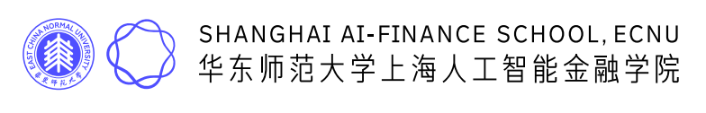

# 初赛项目展示｜2026模塑申城杯·“AI原生·代码进化”青少年AI编程大赛

> **作者**: 
> **发布日期**: 2026年5月26日 09:09
> **来源**: [原文链接](https://mp.weixin.qq.com/s/nivnyBfzrczyt8EZXykuXQ)

---

**‍**

  

****赛事介绍****

上海2026模塑申城杯·人工智能+教育[“AI原生·代码进化”青少年AI编程创新创意大赛](https://mp.weixin.qq.com/s?__biz=MzU2NTU5MTE4Mg==&mid=2247484863&idx=3&sn=b9c237fddb5f89cc12cef1a26a1281f2&scene=21#wechat_redirect)正在火热进行中。本比赛由上海市经信委和上海市教委指导，上海市人工智能行业协会、上海市教师教育学院和上海市科技艺术教育中心主办，由斯坦福成长创新圈、丽瓦信息技术（上海）有限公司和华东师大上海人工智能金融产研院与孵化器承办，旨在打造国内人工智能领域的顶级青少年赛事。以下为初赛阶段项目。因平台规则要求，我们分三篇展示介绍，本文为第一篇。其他各篇链接如下：

[初赛阶段项目展示(二)](https://mp.weixin.qq.com/s?__biz=MzU2NTU5MTE4Mg==&mid=2247485009&idx=2&sn=33f7d172c2e172ba39f85394e5e87303&scene=21#wechat_redirect)

[初赛阶段项目展示(三)](https://mp.weixin.qq.com/s?__biz=MzU2NTU5MTE4Mg==&mid=2247485009&idx=3&sn=5ce90535e49646c3b34bd3b76689d9c4&scene=21#wechat_redirect)

如果您认可、支持任何项目，欢迎在视频中点赞、转发和评论！网络反馈和支持度也是评委项目评选的重要参考因素之一。

  

盲人助跑平台

参赛者：高乾轶（上海民办协和双语尚音学校 7B班）

核心功能：这个平台能帮视障朋友安全出行，也让想做公益的朋友轻松参与，让温暖互相传递，为无障碍生活添一份力。未来或许可以接入更多志愿者团队与公益组织，扩大服务覆盖范围。

AI 数学思维动态推演器

参赛者：易峥昊（华东师范大学第二附属中学附属初级中学 七5班）

核心功能：本项目可帮助中学生减少对搜题和解代的依赖，培养自主思考、逻辑推理和抗挫能力，适用于课后练习、教师辅导和家庭学习场景，具有良好的教育价值与推广前景。

易经可视化 - 东方哲学探索

参赛者：马旻垣（上海市民办文绮中学国际部 汇点高中 G9 班）

指导老师：翁凯（常青藤科创）

核心功能：此网页可应用于国学教育、博物馆展陈等领域，社会价值在于打破迷信误解，用科技重现古代智慧的科学本质，展示了传统文化数字化转型可能性，为非遗传承提供新范式。

  

青少年心理健身房

参赛者：何守一（天津市新华圣功学校 二班）

核心功能：青少年心理健康市场超千亿，但现有方案以 "治疗" 为主，"同伴支持" 几乎空白。心理成长社区填补这个空缺，用同伴互助替代单向咨询，更贴近青少年真实需求。

  

-   AI 伪科学漫画辟谣站
    

参赛者：董轩昊（上海市青浦区协和双语学校7C班）

指导老师：黄佳妮

核心功能：项目以趣味漫画破解伪科学谣言，降低科普门槛、提升公众科学素养，助力网络清朗建设。轻量化服务覆盖学生、家长及大众网民，兼具教育意义与良好市场前景。

  

好好说话

参赛者：冯若楠（上海市位育初级中学 六15班）

指导老师：张天行

核心功能：情绪日记：小孩和家长分别在日记本中记录想与对方交流的想法，梳理沟通需求；数字人伙伴：识别用户最想沟通的问题和潜在冲突点，代入双方的视角进行分析，并推荐沟通话术。

  

文曲喵

参赛者：宋嘉晨（上海市青浦区协和双语学校 7H 班）

指导老师：黄佳妮

核心功能：全国中小学生每学期要写数十篇作文，但是批改长期依赖人工，反馈慢、标准不一。日常写点小练笔也并非篇篇都能得到老师的指导。AI作文批改助手让学生随时获得详细反馈，同时减轻语文老师负担，具有广泛的教育普惠价值。

  

AI 聚合看板

参赛者：余映竹（上海市南洋模范中学 高一7班）

核心功能：当今社会信息高度碎片化，学生常被多平台繁杂消息困扰。本工具省去频繁切换、手动整理的多余耗时，有效提升校园事务处理与学习效率，且隐私安全设计贴合学生日常使用需求。

  

-   宠物无障碍交流（喵语翻译器）
    

参赛者：李忱翰（上海市青浦区协和双语学校 6E 班）

指导老师：黄佳妮

核心功能：我国宠物经济市场规模持续高速增长，预计 2028 年突破四千亿元。随着单身化、老龄化趋势加剧，宠物成为重要情感伴侣。猫语翻译工具能提升人猫沟通质量，提高社会福祉。

  

英语中考词汇 AI 一站通

参赛者：王梓睿（华东师范大学第二附属中学附属初级中学 预备12班）

核心功能：这个软件可以帮助大家轻松搞定中考英语词汇，降低家长老师的焦虑，免去奔波于培训机构的填鸭式学习。支持中考单词语法训练：闪卡记忆、一日一测、错题整理、智能组卷、AI词文转换。基于遗忘曲线智能推荐，支持闪卡、默写、测试、批改、下载、词文生成、挖空、OCR解析等AI应用。实现个性化学情追踪、精准定位薄弱环节，科学规划冲刺复习。

  

欢迎参与！

上海2026模塑申城杯·人工智能+教育“AI原生·代码进化”青少年AI编程创新创意大赛面向在校中学生。跟传统的编程比赛不同，本比赛比的不是做题，而是参赛者根据自己的创意设想、利用AI编程工具开发的软件作品。比赛将从创新性、产品完成度、潜在市场前景和社会价值、受欢迎程度等多重维度，通过评委打分参考网络投票评定优胜作品。  

欢迎访问比赛官网(点击文末阅读原文链接) 查看上述参赛作品，包括更完整的项目介绍以及团队参赛的队员信息（公众号篇幅有限仅体现队长姓名）。有关比赛的具体事宜（包括赛事理念、日程安排、比赛规则等）也详见比赛官网。