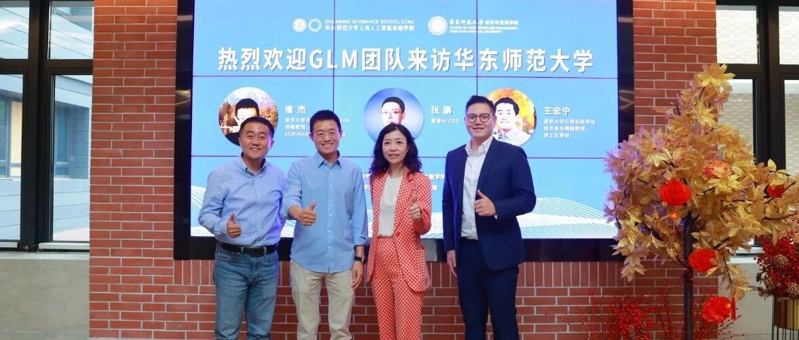
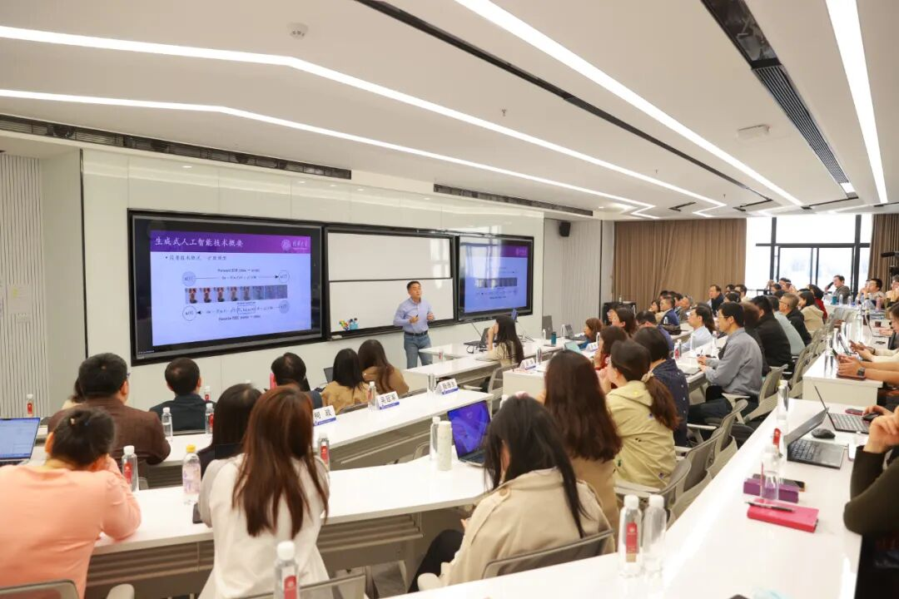
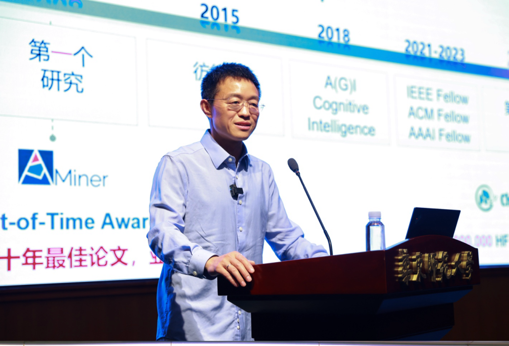

# 清华大学GLM团队唐杰教授一行访问智金院

> **作者**: SAIFS
> **发布日期**: 2024年4月25日 11:50
> **来源**: [原文链接](https://mp.weixin.qq.com/s/idM_2XItjRI1C0qG9SwqQQ)

---

  

  

4月19日，华师大智金院学术委员会委员、清华大学计算机系WeBank讲席教授唐杰与GLM团队成员、智谱AI CEO张鹏和清华大学计算机科学与技术系长聘副教授、博士生导师王宏宁一行访问智金院和经管学院。智金院院长邵怡蕾教授、智金院院长助理汤傲成教授以及经管学院党政班子成员等欢迎唐杰教授一行的来访，并表示未来将积极与GLM团队开展科研和教育项目合作。

  

从左至右：王宏宁，唐杰，邵怡蕾，汤傲成

  

上午会议，王宏宁教授在经管学院教工大会暨教职工政治理论学习会上给全体经管学院教师作《人工智能辅助教育的探索与试点》专题报告。报告旨在推动教育数字化进程，并探讨人工智能与教学的深度融合。

  

  

  

王宏宁作《人工智能辅助教育的探索与试点》专题报告

  

首先，他简要介绍了近年生成式人工智能技术发展的背景和过程，随着智能时代的到来，人工智能将成为世界高校争先占领的高地。王宏宁在报告中展示了人工智能教育方面的最新应用成果，重点分享了人工智能技术在提升教学质量、帮助教师更好地理解学生需求、提供更加个性化的教学支持等方面的内容。

  

下午，智金院学术委员会委员唐杰教授为华师大校委理论学习中心组学习（扩大）会作《从大模型到AGI的一点思考》专题报告。

  

唐杰作《从大模型到AGI的一点思考》中心组扩大会议报告

  

唐杰的报告深入探讨了大型语言模型在人工智能领域的重要进展及其对未来技术的启示。随着智能时代的快速发展，大型语言模型如ChatGLM等在自然语言理解、文本生成、图像处理以及多模态建模等任务上取得了显著成效。他回顾了人工智能过去几十年的发展历程，并分享了自研国产对话大模型ChatGLM在研发过程中遇到的挑战与成就。报告中，他强调了通用人工智能（AGI）的潜在机遇与挑战，同时指出，虽然目前的技术进展令人鼓舞，但实现AGI仍然面临诸多技术和伦理难题。

  

会后，GLM团队成员与智金院、经管学院相关领导就未来科研和教育项目合作方面进行深入探讨。

  

图文提供｜华师大智金院SAIFS、华师大经管学院