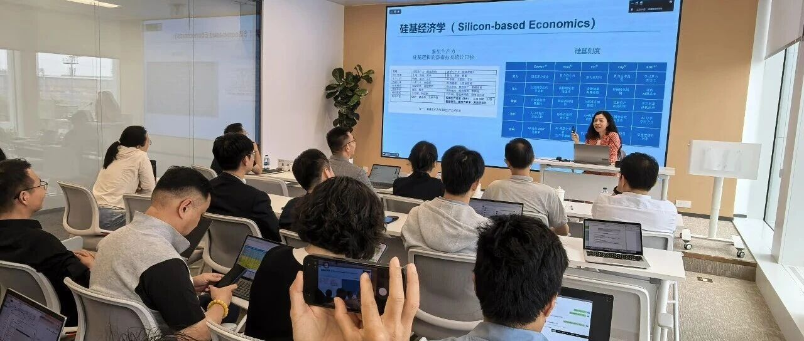
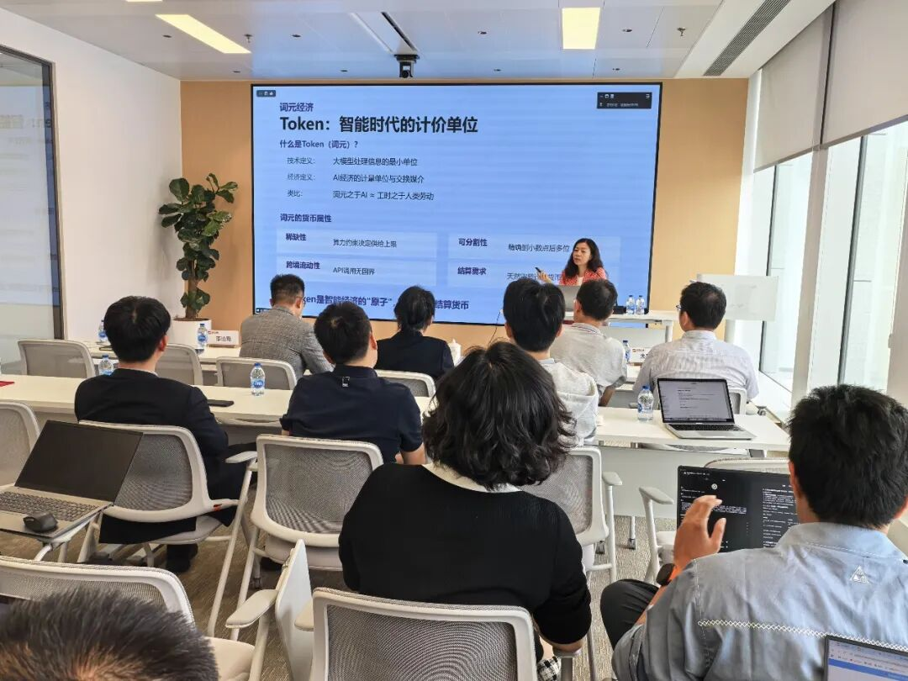
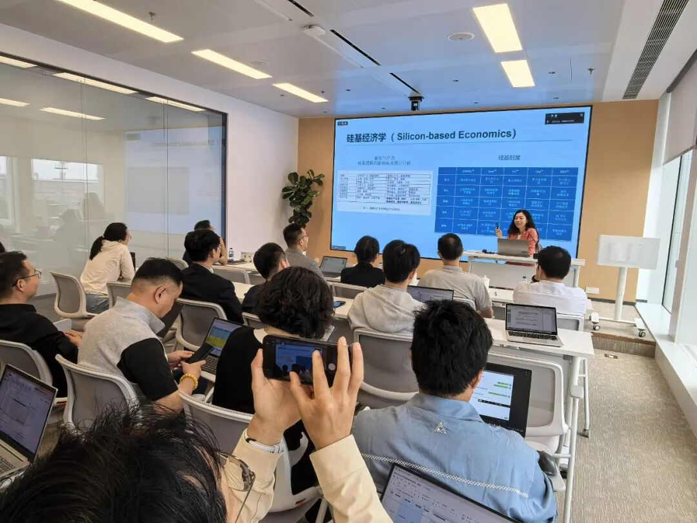

# 讲座回顾｜智金院院长邵怡蕾教授应邀赴证通公司开展专题讲座

> **作者**: SAIFS
> **发布日期**: 2026年5月26日 11:25
> **来源**: [原文链接](https://mp.weixin.qq.com/s/4K5BtYZaKVCr0t1Et3YMjQ)

---

  

  

  

     2026年5月19日，我院院长邵怡蕾教授受邀赴证通公司，开展《以词为锚——人工智能、Token经济与数字人民币的协同出海》的专题讲座。证通公司高管及相关同事出席并参与了此次讲座。

  

  

     此次讲座涵盖了从AI前沿趋势、国际竞争格局、硅基经济学，到人工智能金融、Token经济与出海以及人民币国际化的完整脉络。邵怡蕾教授认为，可以把Token理解为AI模型运行的基础消耗品，如同石油之于工业文明，具有真实的使用价值与稀缺性逻辑。同时指出，模型公司发行Token权证，本质上是将未来Token提前资产化，购买Token权证即购买未来服务使用权，天然具备远期合约属性。邵怡蕾教授进一步指出，将数字人民币或人民币稳定币与Token经济深度绑定，可实现智能出海与货币出海双向赋能：中国大模型、算力服务出海，同步推广人民币结算；人民币结算体系完善，进一步提升中国智能产品全球竞争力。

  

  

    讲座结束后，在座高管、同事与邵怡蕾教授就数据隐私性、数据流通性、行业专家组织方式与算力期货的前景等具有实践性的问题展开交流，现场氛围热烈，互动深入。