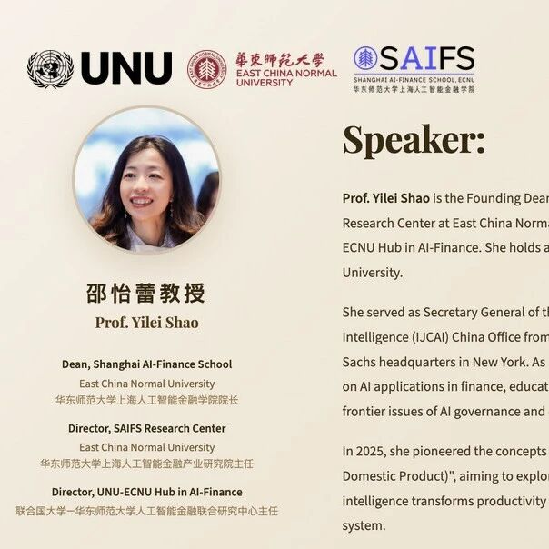

# Preview | Prof. Yilei Shao & Rector Tshilidzi Marwala：Reimaging the Wealth of Nations: From Invisible Hand to Digital Hand

> **作者**: 
> **发布日期**: 2026年5月28日 16:50
> **来源**: [原文链接](https://mp.weixin.qq.com/s/b4R5RxmgTK9FBfmpax-HuQ)

---

  

  

  

****关于本次活动****

2026年6月5日，我们的院长邵艺磊教授将受邀参加联合国大学（UNU）主办的一场高层对话，主题为“重新想象国富：从无形之手到数字之手”。 邵艺磊教授是华东师范大学上海人工智能金融学院（SAIFS）和上海人工智能金融研究中心的创始院长，同时也是东大-欧洲国家大学人工智能金融中心主任。活动将于18：30在东京联合国大学总部2楼接待大厅开始。欢迎所有人关注此次活动。

****背景****

在古典经济体系中，经济活动和繁荣主要通过有形生产、实物资产和具体交易来衡量。然而，如今，情报正在重塑经济的基础。因此，亚当·斯密著名描述的“看不见之手”，即个人自利无意中推动公共利益的去中心化机制，正被“数字之手”所取代或补充。

  

为了更准确地反映基于硅谷经济的特征，在这种经济中价值往往无形，邵教授提出了IDP（智能国内生产产品）——一种“硅指数”。虽然GDP主要旨在衡量以碳为基础、以制造为导向的经济，但IDP则考虑了计算能力、数据丰富度、算法能力、智能基础设施以及人机协作的深度。

****  
话题****

在本次对话中，邵艺磊教授将与联合国大学校长齐利齐·马尔瓦拉教授进行高层讨论，探讨技术如何改变人工智能时代资本、资源和经济活动的概念。本次讨论还将探讨建立新治理框架以应对新兴风险、促进问责、透明和公平的必要性。

****活动详情****

日期与时间：2026年6月5日，星期五，18：30

**场地：**东京联合国大学总部接待大厅2楼

**语言：**英语

**注册：**需提前注册。报名截止日期为2026年6月4日15：00。请点击下方链接中的“注册”按钮，访问在线注册页面。

🔗https://unu.edu/conversation-series/reimagining-wealth-nations-invisible-hand-digital-hand

**值机：**请准备好在办理时出示身份证明。

****关于议长****

 

  

Prof. Tshilidzi Marwala is the Under-Secretary-General of the United Nations and Rector of the United Nations University. He is also the Foreign Member of the Chinese Academy of Sciences (CAS), Member of the Academy of Science of South Africa (ASSAF) and South Africa Academy of Engineering (SAAE), and Foreign Member of the American Academy of Arts and Sciences in the United States (The Academy). Prof. Marwala has extensive academic, policy, management, and international experience, and is a co-holder of five patents. His research has been multi-disciplinary, involving the theory and applications of artificial intelligence to engineering, social science, economics, politics, finance, and medicine. He holds a PhD degree from the University of Cambridge (UK), a Master of Mechanical Engineering degree from the University of Pretoria (South Africa), and a Bachelor of Science degree (magna cum laude) from Case Western Reserve University (USA).

  

Professor Yilei Shao,Founding Dean of Shanghai AI-Finance School (SAIFS) and SAIFS Research Center at ECNU, Director of UNU-ECNU Hub in AI-Finance at ECNU, holds a Ph.D. degree in Computer Science from Princeton University. She was the former Secretary General of the International Joint Conference on Artificial Intelligence (IJCAI) China Office from 2021 to 2023. In her previous experience, she has worked at Goldman Sachs’s headquarters in New York. As a pioneering interdisciplinary scholar, she not only focuses on the application of AI in the financial sector but also actively explores its innovative integration into education and arts, while deeply engaging with frontier issues such as AI governance and ethics. In 2025, she pioneered the concepts of “Silicon-based Economics”and“IDP(Intelligent Domestic Product)”, aiming to explore both theoretically and quantitatively how intelligence transforms productivity and reshapes the global political and economic system.

****  
Notes****

This is part of the UNU Conversation Series, which aims to foster audience participation. You are encouraged to engage with the speakers during the conversation and at the reception that will follow, where all event attendees are invited to enjoy hors d’oeuvres and drinks while exchanging ideas and making new contacts.

  

Please note that food and photography are prohibited during events at UNU Headquarters, unless prior permission is granted by UNU.