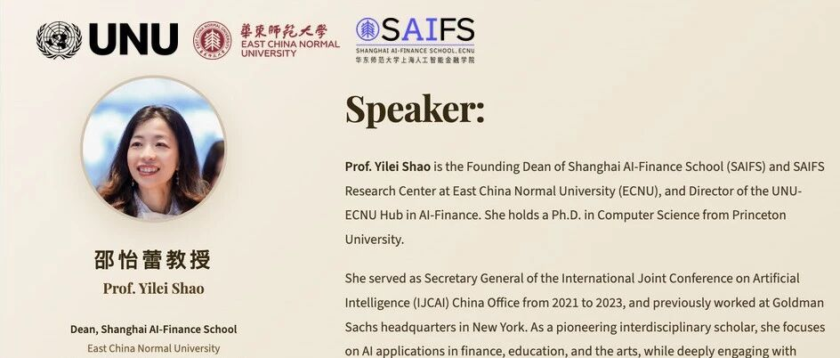
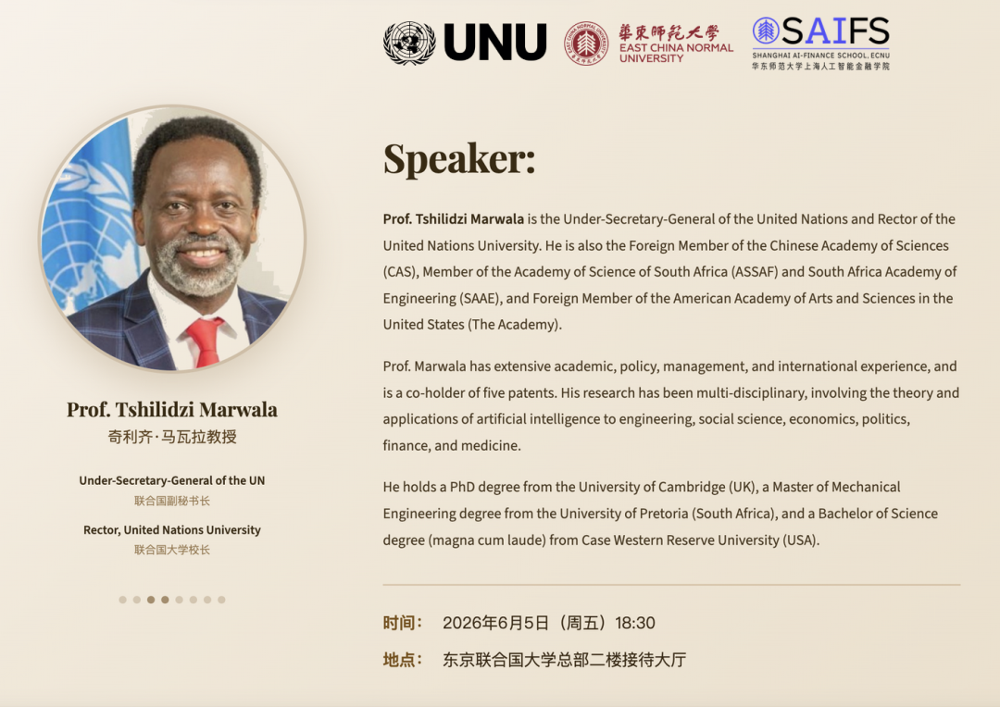
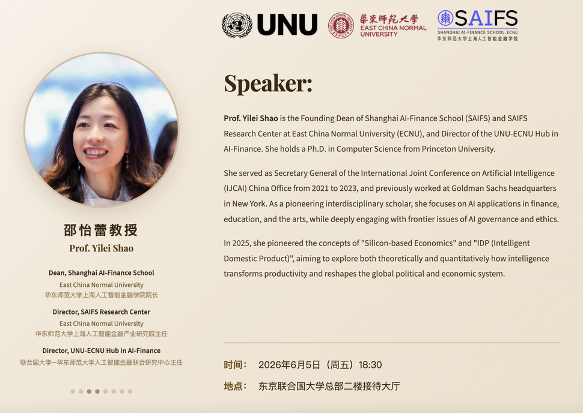

# 活动预告｜智金院院长邵怡蕾教授将与联合国副秘书长、联合国大学校长奇利齐·马瓦拉教授进行对话：《新国富论：从无形之手到数字之手》

> **作者**: 
> **发布日期**: 2026年5月28日 16:50
> **来源**: [原文链接](https://mp.weixin.qq.com/s/i9A2JdOwaqf65sqLuy-vpA)

---

  

  

  

****活动简介****

    我院院长邵怡蕾教授将于2026年6月5日受邀参加联合国大学举办的高层对话活动，主题为《新国富论：从无形之手到数字之手》。邵怡蕾教授现任华东师范大学上海人工智能金融学院创始院长、华东师范大学上海人工智能金融产业研究院及孵化器主任，同时担任联合国大学—华东师范大学人工智能金融联合研究中心主任。活动将于东京联合国大学总部二楼接待大厅18:30正式召开，届时欢迎各界人士关注。

  

****活动背景****

    在古典经济体系中，经济活动水平与社会繁荣程度主要以实体产品、物质资产及线下实物交易作为衡量标准。而如今，智能科技正在重塑经济底座。亚当·斯密提出的著名“无形之手”——一种去中心化的市场机制，使个体在追逐自身利益的同时能够无意间增进社会公共福祉——如今正被"数字之手"所取代或补充。

    为更精准刻画硅基经济的特征（这类经济形态下的价值往往以无形形式存在），邵怡蕾教授提出了智能生产总值（IDP），又称硅基指数。GDP最初主要用于衡量碳基、制造业主导型经济体，而IDP则涵盖算力、数据丰富度、算法能力、智能基础设施以及人机协同深度等核心维度。

  

****对话内容  
****

     在本次对话中，邵怡蕾教授将与联合国大学校长奇利齐·马瓦拉教授展开高级别研讨，探讨在人工智能时代，科技如何重塑资本、资源与经济活动的定义，以及建立全新治理框架的必要性，以期应对各类新兴风险，推进责任落实、信息透明与发展公平。  

  

****活动信息****

时间：2026年6月5日（周五）18:30

地点：东京联合国大学总部二楼接待大厅

语言：全程英文

注册：活动需提前注册，截止时间为2026年6月4日15:00，请点击请点击下方链接中的注册按钮进入线上报名页面

🔗https://unu.edu/conversation-series/reimagining-wealth-nations-invisible-hand-digital-hand

入场：签到时请务必准备好有效身份证件以备查验

  

****对话嘉宾简介****

 

  

    Tshilidzi Marwala教授现任联合国副秘书长兼任联合国大学校长，自2023年3月起履职。他曾于2018-2023年担任南非约翰内斯堡大学的副校长和校长，期间历任该校主管科研与国际事务的副校长（2013-2017）、工程与建筑环境学院执行院长（2009-2013）等重要职务。Marwala同时担任中国科学院外籍院士，南非科学院及南非工程院院士，以及美国艺术与科学院外籍院士。作为一名具有全球影响力的跨学科学者，Marwala教授曾在美国、英国、中国及南非多所顶尖高校担任客座教授，并拥有五项技术专利。他的研究涉及多个学科，包括人工智能理论及其在工程、社会科学、经济、政治、金融和医学领域的应用。他曾在多个全球和国家决策机构任职，并与联合国教科文组织、联合国儿童基金会、世界卫生组织和世界知识产权组织等联合国机构合作。他曾先后取得英国剑桥大学博士学位、南非比勒陀利亚大学机械工程硕士学位，以及美国凯斯西储大学理学学士学位（最高荣誉毕业）。

  

  

    邵怡蕾教授，华东师范大学上海人工智能金融学院院长，华东师范大学上海人工智能金融产业研究院及孵化器主任，联合国大学-华东师范大学人工智能金融联合研究中心主任，普林斯顿大学计算机科学博士。她曾于2021年至2023年担任国际人工智能联合会（IJCAI）中国办公室秘书长，并曾在高盛集团纽约总部任职。作为一位学科跨界的开拓者，她不仅关注人工智能技术在金融领域的应用，更积极探索其在教育和艺术领域的创新融合，并深入思考人工智能的伦理与治理等前沿问题。2025年，她亦首次提出了“硅基经济学”这一新兴理念，致力于从理论到量化地研究智能带来的生产力变革及全球政治经济格局的重塑。

  

****注意事项****

    本次活动是联合国大学系列对话活动之一，旨在鼓励观众参与互动交流，欢迎各位在对话环节及随后的招待会中与演讲嘉宾积极交流。所有参会嘉宾均可享用精致小食与饮品，在交流观点的同时拓展人脉。请注意：未经联合国大学事先许可，禁止在联合国大学总部活动现场饮食及拍照。