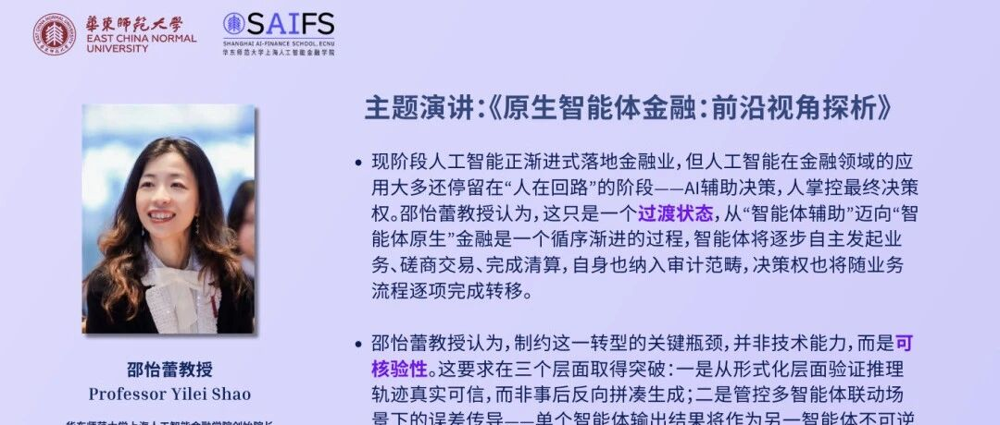
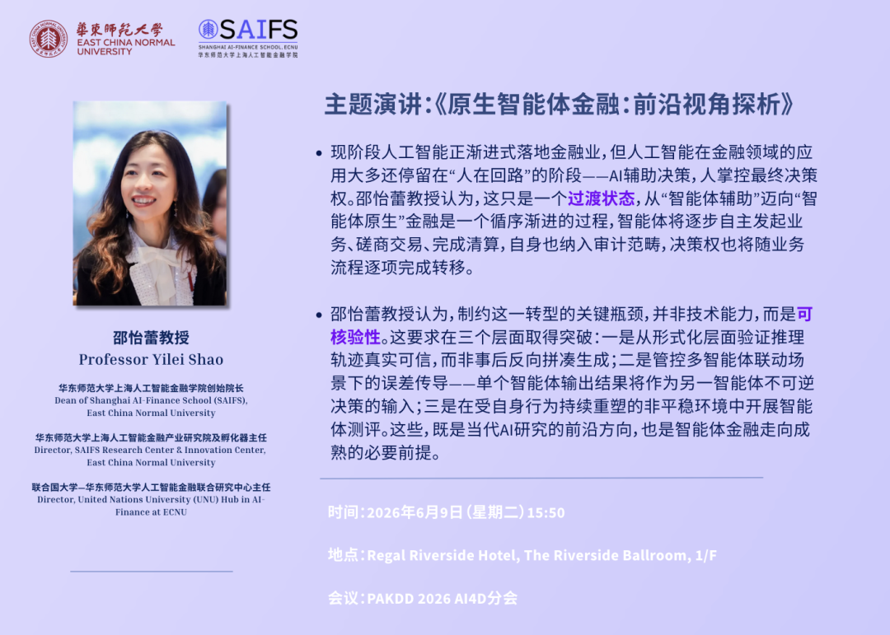

# 活动预告 | 智金院院长邵怡蕾教授受邀出席第30届亚太知识发现与数据挖掘会议（PAKDD 2026）并发表演讲

> **作者**: SAIFS
> **发布日期**: 2026年6月6日 08:59
> **来源**: [原文链接](https://mp.weixin.qq.com/s/Zn7db7AH-E2fVPpTYSrk3A)

---

  

  

  

****活动简介****

    我院院长邵怡蕾教授将于2026年6月9日出席第30届亚太知识发现与数据挖掘会议（PAKDD 2026）举办的 AI4DF 分会（AI and Data Science for Digital Finance），并发表《原生智能体金融：前沿视角探析》主题演讲。邵怡蕾教授现任华东师范大学上海人工智能金融学院创始院长、华东师范大学上海人工智能金融产业研究院及孵化器主任，同时担任联合国大学—华东师范大学人工智能金融联合研究中心主任。邵怡蕾教授的演讲将于中国香港6月9日15:50开始，届时欢迎各界人士关注、参与讨论。

  

****演讲内容****

  

  

    现阶段人工智能正渐进式落地金融业，但人工智能在金融领域的应用大多还停留在“人在回路”的阶段——AI辅助决策，人掌控最终决策权。邵怡蕾教授认为，这只是一个过渡状态，从“智能体辅助”迈向“智能体原生”金融是一个循序渐进的过程，智能体将逐步自主发起业务、磋商交易、完成清算，自身也纳入审计范畴，决策权也将随业务流程逐项完成转移。 

    基于对“将推理模型应用于某大型商业银行线上信贷业务投产案例”的实证研究，邵怡蕾教授团队发现了标准测试无法覆盖的三类失效情形：自反反馈引发的数据分布偏移、看似合理却虚假的推理链路，以及决策权与责任边界日渐模糊的困境。

    基于此，邵怡蕾教授认为，制约这一转型的关键瓶颈，并非技术能力，而是可核验性。这要求在三个层面取得突破：一是从形式化层面验证推理轨迹真实可信，而非事后反向拼凑生成；二是管控多智能体联动场景下的误差传导——单个智能体输出结果将作为另一智能体不可逆决策的输入；三是在受自身行为持续重塑的非平稳环境中开展智能体测评。这些，既是当代AI研究的前沿方向，也是智能体金融走向成熟的必要前提。

  

****关于PAKDD与AI4DF分会  
****

     PAKDD（Pacific-Asia Conference on Knowledge Discovery and Data Mining，亚太知识发现与数据挖掘会议） 是业内权威性高、录用筛选严苛的顶级学术会议。AI4DF分会（AI and Data Science for Digital Finance，面向数字金融的人工智能与数据科学）汇聚人工智能与数据科学在数字金融研发落地的科研学者、一线从业者、行业专家及政策制定人员，旨在围绕相关技术如何变革传统银行业、支付体系与资产管理，并构建去中心化金融、数字货币全新发展范式开展跨学科交流。本次AI4DF分会的主题是“赋能数字金融的人工智能与数据科学：变革市场、资产与普惠金融”。本次AI4DF分会邀请了来自阿姆斯特丹大学、香港树仁大学、杜克昆山大学和同济大学等的国际知名学者，他们将与邵怡蕾教授共同呈现最新研究成果与学术观点。  

  

****演讲信息****

时间：2026年6月9日（星期二）15:50

地点：Regal Riverside Hotel, The Riverside Ballroom, 1/F

语言：全程英文

注册：登陆 PAKDD 2026会议报名系统进行报名，链接如下

🔗https://PAKDD2026.scimeeting.cn/en/reg/index/34322

  

欢迎各位的关注与参与！