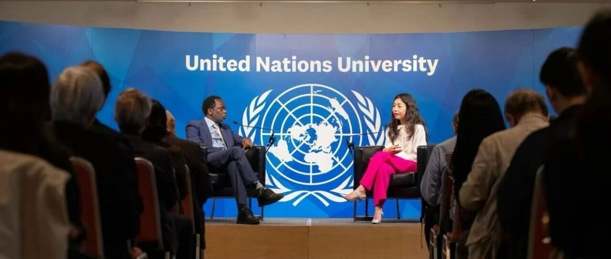
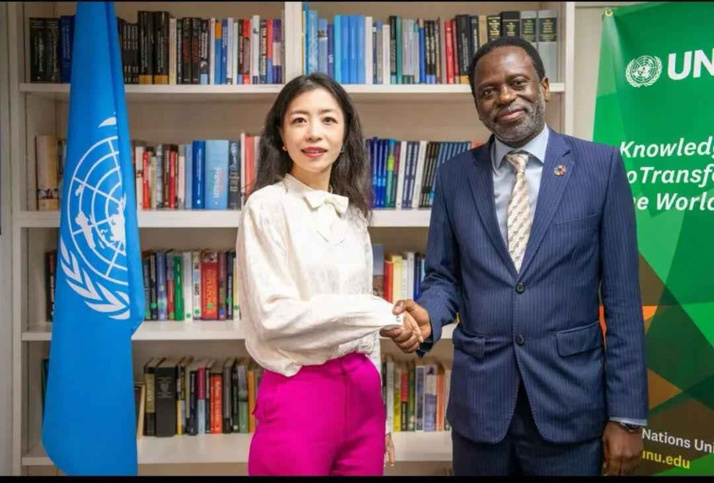
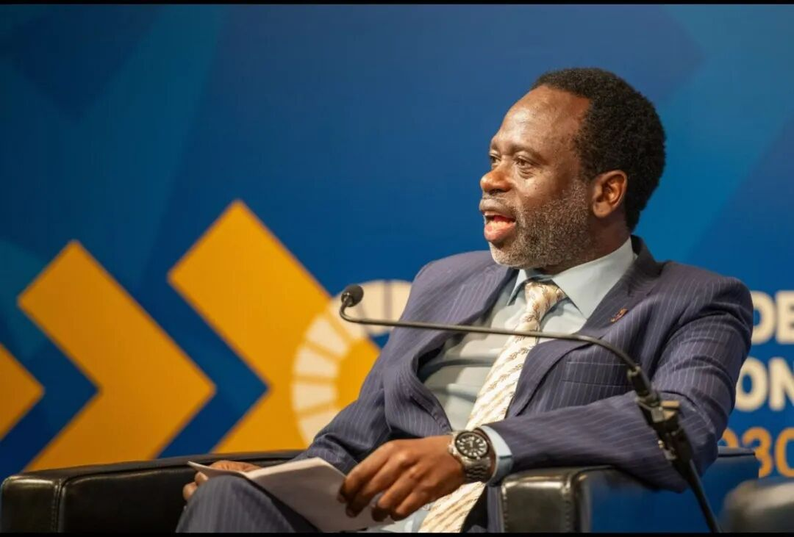

# 活动回顾｜智金院院长邵怡蕾教授与联合国副秘书长、联合国大学校长奇利齐·马瓦拉教授进行对话：《新国富论：从无形之手到数字之手》

> **作者**: SAIFS
> **发布日期**: 2026年6月10日 19:50
> **来源**: [原文链接](https://mp.weixin.qq.com/s/kI-KTqbj_4UeR8x8S1f65g)

---

  

  

  

     2026年6月5日，我院院长邵怡蕾教授与联合国大学校长奇利齐·马瓦拉教授于东京联合国大学总部进行高层次对话活动，主题为《新国富论：从无形之手到数字之手》。参会观众覆盖联合国大学内部人员、高校学生以及相关企业人士等。

  

智金院院长邵怡蕾教授与联合国大学校长奇利齐·马瓦拉教授合影

     

    本次对谈围绕硅基经济学理论框架、全球智能治理机制以及青年发展等核心议题展开，深入刻画了人工智能时代的新经济形态与发展挑战。对谈伊始，双方聚焦邵怡蕾教授提出的核心概念——硅基经济学与智能生产总值（IDP），探讨了衡量IDP的难点，并就硅指数如何实现一国智能发展、为政策制定者提供参考进行了深入交流。

  

智金院院长邵怡蕾教授与联合国大学校长奇利齐·马瓦拉教授进行对谈

  

    随后，对谈对比了古典经济学“看不见的手” 与新时代 “数字之手” 的本质差异，进并一步探讨全球智能生产国与消费国的战略定位。双方还就人工智能版欧佩克（AI-OPEC）的运作逻辑、设立价值及联合国的平台作用展开交流，解读多国智能要素获取权的实际意义，并探究人机协作深度的量化方式。

  

联合国大学校长、联合国副秘书长奇利齐·马瓦拉教授

  

    此外，结合碳基经济时代后发国家发展的案例，双方还就全球南方国家在硅基经济中的发展处境进行研判，最后针对当下青年的职业发展与未来选择给出相关建议。整场交流立足前沿理论与现实问题，为全球应对硅基经济变革、完善人工智能治理提供了深刻思路与有益参考。

  

华东师范大学上海人工智能金融学院院长邵怡蕾教授

  

    对谈结束后，在座观众积极与邵怡蕾教授和联合国大学校长奇利齐·马瓦拉教授进行具体的对话互动，就AI对于当下就业的影响、对不同行业的影响差异以及未来经济形态变化等问题展开进一步交流。活动现场气氛活跃，反响热烈。