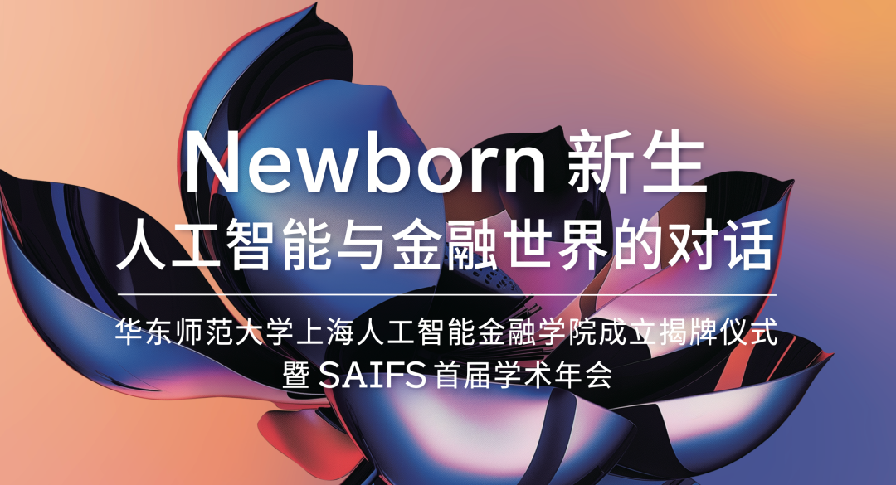
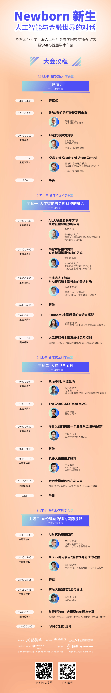
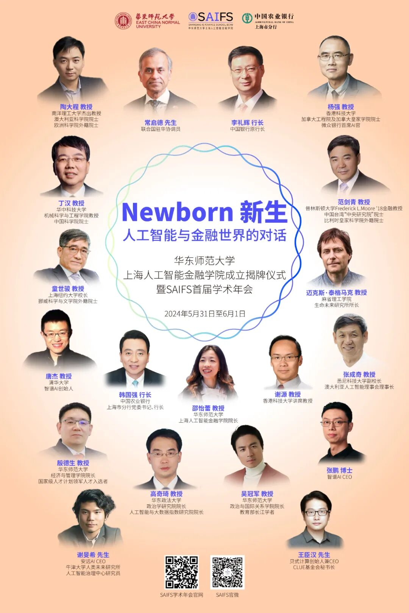

# 华东师大上海人工智能金融学院正式成立！MIT教授Max Tegmark、5位院士、12位AI金融专家共探AI-Fin新机遇

> **作者**: 李宝珠
> **发布日期**: 2024年5月23日 19:05
> **来源**: [原文链接](https://mp.weixin.qq.com/s/-FofRkiP4YVw7VHWYm4BRg)

---

  

华东师范大学上海人工智能金融学院成立揭牌仪式暨 SAIFS 首届学术年会将于 5 月31 日—6 月 1 日在上海举行。  

  

近年来，AI、特别是机器学习，已经在金融数据分析、风险预估、投资管理等任务中实现了效率、准确率的提升，为银行、保险、基金、券商等机构的业务转型提供了强劲动能。随着大模型概念的持续走热，「金融大模型」也成为行业热议话题。然而，不同于工业、建筑等传统行业大刀阔斧地进行智能化升级，金融与 AI 的结合在数据合规、隐私安全、市场监管等方面面临着更加严苛的挑战，需要政产学研多方协同推进。

  

不仅打破 AI 技术与金融知识之间的「柏林墙」至关重要，同时还需要将理论知识与产业痛点相结合，才能够更好利用 AI 技术推进金融科技创新，这便要求研究人员具备交叉学科背景。此外，先进 AI 技术应用所带来的风险同样不容忽视，应该在科研阶段就明确应对之策。

  

洞察 AI 金融发展趋势，**华东师范大学于 2023 年建设上海人工智能金融学院（简称 SAIFS），**作为全球首家围绕人工智能与金融跨界交叉打造的教育和研究机构，SAIFS 强调在超越知识点的通识教育的基础上，培养集金融知识、人工智能技术和实践经验于一身的新一代人工智能金融 (AI-Fin) 人才。

  

**华东师范大学上海人工智能金融学院成立揭牌仪式暨 SAIFS 首届学术年会将于 5 月31 日—6 月 1 日在上海举行，**在成立揭牌仪式后，还邀请到了多位资深专家学者与行业翘楚，将围绕 AI-Fin 的发展趋势与行业创新展开一场精彩的思维碰撞！

  

  

**横向覆盖 AI 与金融，纵向贯穿学术与产业**

  

**除成立揭牌仪式之外，SAIFS 首届学术年会聚焦三大议题，将带来 15 场主题演讲与 3 场圆桌论坛。**中外嘉宾将围绕「人工智能与金融科技的融合、大模型与金融、AI 伦理与治理的国际视野」，分享前沿技术与行业洞察，并通过观点碰撞探讨业内十分关注的金融大模型应用及大模型伦理问题。

  

**上下滑动查看详细议程**

  

  

**SAIFS 首届学术年会共邀请到了 4 大洲 18 位 AI 领域、金融领域以及跨学科领域的顶尖学者和产业领军者，**从学术与行业应用的不同视角，共同探索 AI-Fin 的机遇与挑战。演讲嘉宾名单如下：

  

  

  

**SAIFS：培养将 AI 与金融智慧融入世界的未来塑造者**

  

**华东师范大学上海人工智能金融学院坚持扎根在学术研究的前沿，将打造人工智能金融 (AI-Fin) 研究中心和人工智能伦理与治理 (AI-PPE) 研究中心两大中心，**探索AI在金融中的新应用，驱动 AI-Fin 的稳健发展。同时，SAIFS 致力于与全球的学术机构、金融机构、科技公司和政府部门建立广泛的合作网络，通过推广AI与金融的交叉研究和应用，改善金融服务的效率和质量，为社会创造价值。

  

SAIFS 创院院长邵怡蕾教授指出，**「我们培养的是将人工智能与金融智慧融入世界的未来塑造者 。」**SAIFS 是一个比 AI 更年轻的学院，将与AI的新世代共同成长。

  

邵怡蕾院长直言，之所以选择了人工智能与金融的交叉点，是因为人工智能的发展与金融的发展高度相似：两者都充满了流动的复杂性。此外，这两个跨界于理科与文科之间的学科对于科学与人文的影响同样重要。金融塑造了二战之后的世界体系，人工智能将塑造当下的世界格局以及人类和它种智能共存的未来。AI 和金融都是「大制无割」最生动的社会性表达。   

  

更多关于 SAIFS 的信息，不妨亲临「华东师范大学上海人工智能金融学院成立揭牌仪式暨 SAIFS 首届学术年会」活动现场，感受一场酣畅淋漓的 AI-Fin 学术盛宴！

  

**点击「阅读原文」即可报名参会！**

  

**报名链接：  
**

*https://saifs.ecnu.edu.cn/xsnh/list.htm*