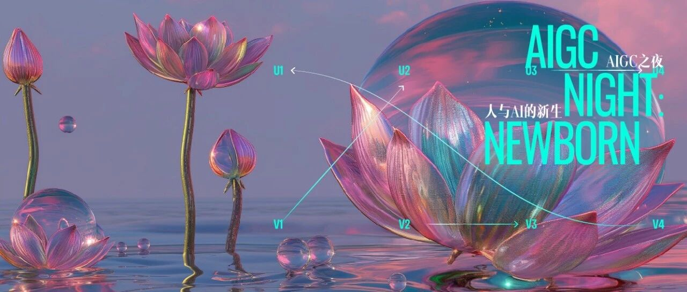
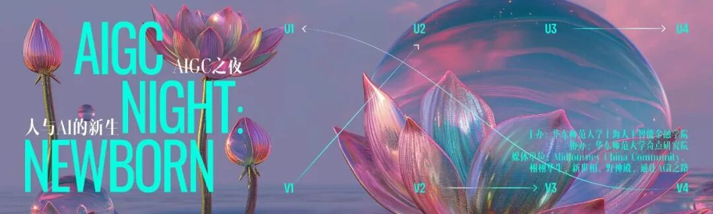
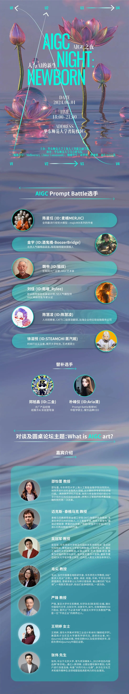

# 今年六一：关于艺术、AI与人类的未来，我们决定先搞清楚这件事

> **作者**: 
> **发布日期**: 2024年5月25日 20:15
> **来源**: [原文链接](https://mp.weixin.qq.com/s/iBbf-dfm1Cjbe7o3czhfWQ)

---

  

  

如果你也关注 AI 领域，这将是一个你不该错过的定义性时刻：  

就在一周之后（6月1日），一场以**“AIGC之夜：人与AI的新生”**为主题的 AI 艺术研讨活动将在上海举行。

作为**“Newborn新生：人工智能与金融世界的对话”学术会议的闭幕式暨after-party**，“AIGC之夜”将由华东师范大学上海人工智能金融学院和经济与管理学院主办，华东师范大学奇点研究院协办，中国农业银行上海市分行独家支持。

新世相作为此次活动的主要媒体合作平台之一，将密切参与其中，见证这个人与AI共生的开端性时刻。

为什么这个夜晚如此重要？

2024年，是AI艺术的元年。而作为一种新的艺术形态，AI艺术缺少创作标准和定义的讨论与建造，因而有创作，但缺少创作观和体系。

在当下阶段，严肃的、学术的、专业的研究者和艺术创作者对AI艺术有关注，但缺少契机去进行一次共同而广泛的碰撞。关于AI艺术的讨论空前热烈，却又多元而分散。

因此，在这个夜晚，我们期待一次有组织、高水平的讨论能够推动 AI 艺术成为一种被认可的艺术形式。

  

你将在这个夜晚见证什么？

  

这场活动将尝试在人工智能历史上首次定义**“第十艺术：人与AI互动的艺术”—邵怡蕾**，展现人与AI这两种智能共同探索广袤的智慧和艺术潜在空间的历程。

你将在这场活动上收获什么？

你将收获一场高水平的 AIGC 现场Prompt Battle。参与比拼的 6 位创作者皆为 AIGC 领域内的顶尖高手，包括**陈星任（ID：麦橘MERJIC）、金宇（ID：酒鬼橋-BoozerBridge）、魏申（ID：猫叔）、刘佳（ID：南墙\_Rylee）、陈慧凌（ID：陈慧凌）、徐滋悦（ID：STEAMCHI 蒸汽姬）**。

你还将收获一场围绕“What is AIGC art?”的圆桌讨论与即兴辩论。为了达成一次关于 AI 艺术的严肃的、学术的、面向大众的讨论，这场圆桌的嘉宾容纳了来自物理学、文学、金融学等多个跨学科领域的专家，他们是：

邵怡蕾教授、迈克斯·泰格马克教授、吴冠军教授、严锋教授、毛尖教授、王玥婷女士、张伟先生

**活动时间和地点：**

2024年6月1日，18:00-21:00

华东师范大学普陀校区

在艺术与技术的十字路口，我们期待更多的同行者。

  

  

  

  

文字：华东师范大学上海人工智能金融学院、AIGC艺术家野菩萨

  

图片：AIGC艺术家海绵崽崽、栩栩华生

  

文字撰写：新世相

  

图片编辑：华东师范大学经济与管理学院